# Architectures and Algorithms for Track Association and Fusion

- [Architectures and Algorithms for Track Association and Fusion](#architectures-and-algorithms-for-track-association-and-fusion)
  - [融合策略](#融合策略)
    - [sensor-to-sensor](#sensor-to-sensor)
    - [sensor-to-sensor](#sensor-to-sensor-1)
  - [Technical Issues](#technical-issues)
    - [Correlated Estimation Errors](#correlated-estimation-errors)
  - [Track State Estimate Fusion](#track-state-estimate-fusion)
    - [“Best” Linear Combination of Estimates](#best-linear-combination-of-estimates)
      - [Basic Convex Combination](#basic-convex-combination)
      - [Linear Combination with Cross Covariance](#linear-combination-with-cross-covariance)
    - [Reconstruction of Centralized Estimate](#reconstruction-of-centralized-estimate)
      - [Information De-correlation](#information-de-correlation)
      - [Equivalent Measurement](#equivalent-measurement)

## 融合策略

### sensor-to-sensor

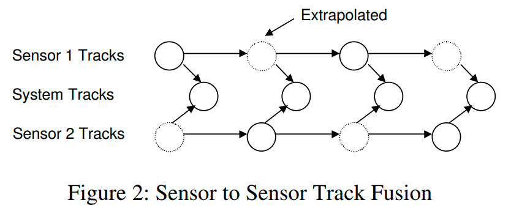

> 传感器之间的航迹进行关联、融合，生成一个系统航迹。

算法优劣：
> This architecture does not have to deal with the
problem of correlated estimation errors (if the common prior is ignored). Since it is basically a memoryless operation, the errors in association and track estimate fusion are not propagated from one time to the
next. However, this approach may not be as efficient
as sensor to system track fusion since past processing
results are discarded

### sensor-to-sensor

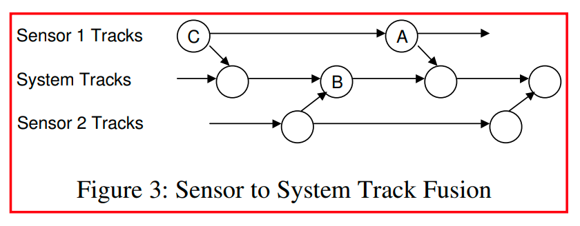

> 每次有局部传感器的航迹来时，对全局航迹进行一次更新
> 在trace-fusion之前，所有局部传感器需要进各自的航迹预测到当前同一时刻

算法优劣：

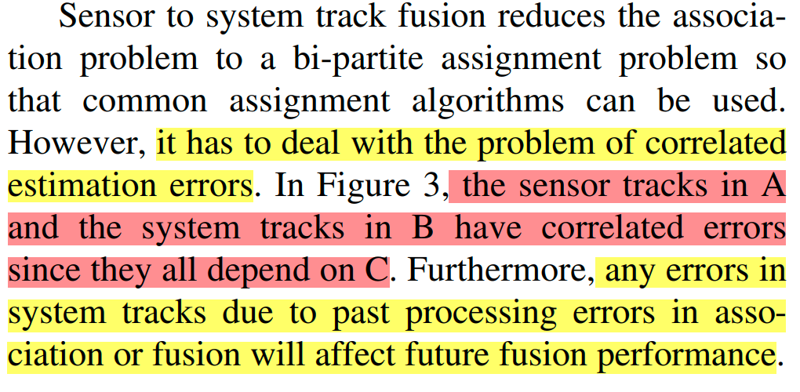

## Technical Issues

### Correlated Estimation Errors

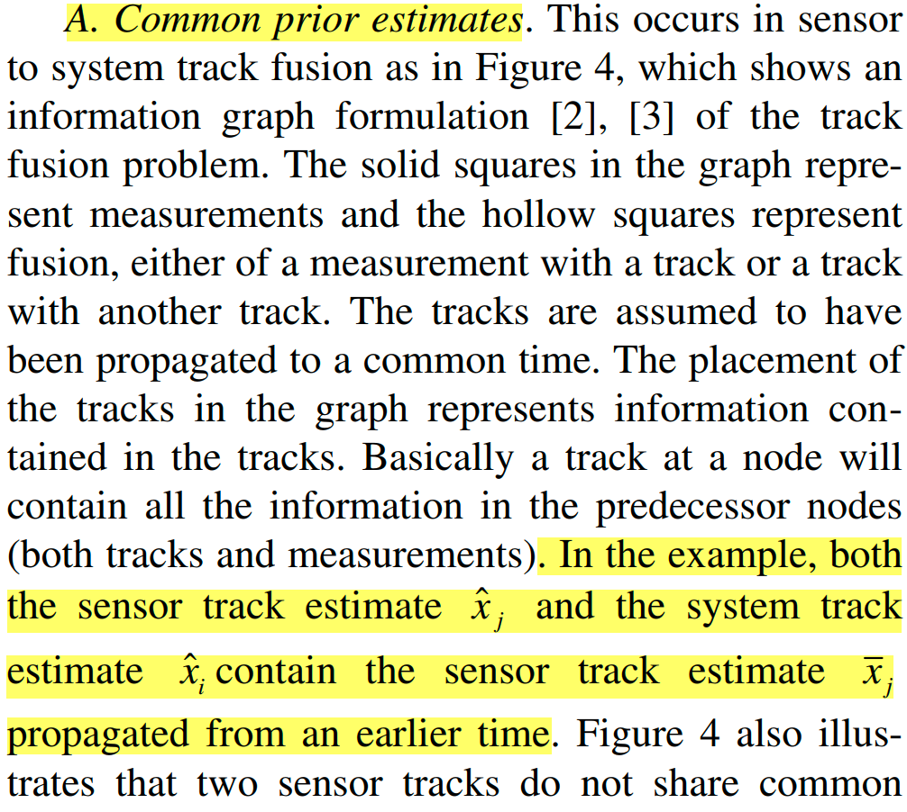

## Track State Estimate Fusion

### “Best” Linear Combination of Estimates
> The fused estimate is constrained to be a linear
combination of the track estimates

>ex.  X = Ax1 + Bx2 ; 加权重组

#### Basic Convex Combination

**State estimate:**

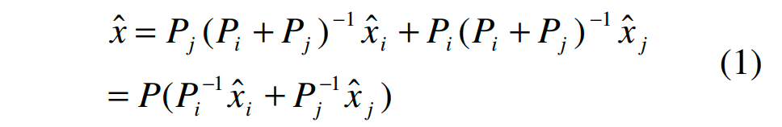

**Error covariance:**

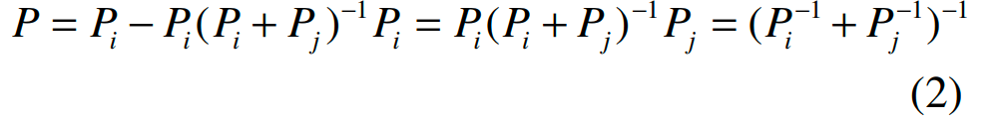

优劣势：

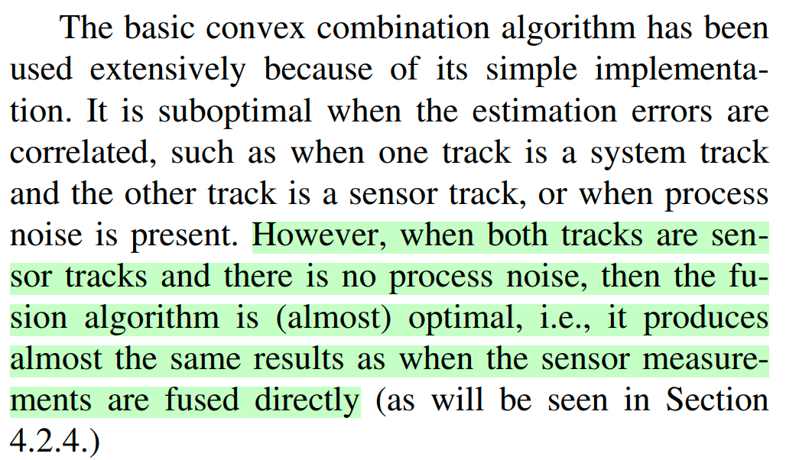

----

#### Linear Combination with Cross Covariance

**State estimate:**

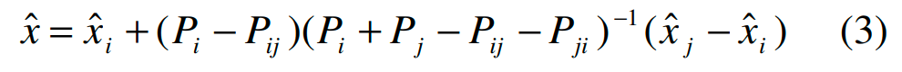

**Error covariance:**

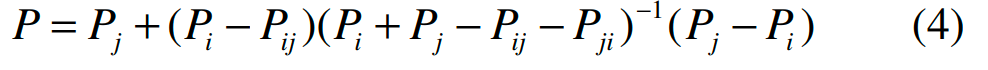

其中：

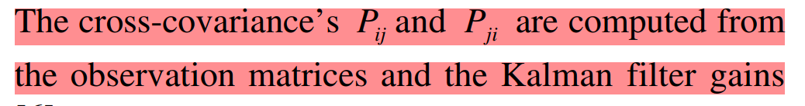

优劣势：

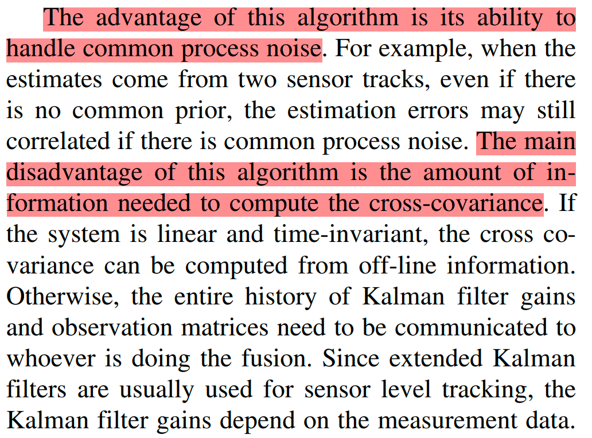

> 由于计算交叉协方差需要用到卡尔曼滤波过程中的增益，因此需要各传感器输出该参数。

---

### Reconstruction of Centralized Estimate

#### Information De-correlation
> This approach is useful when one track is the system track and the other track is the sensor track.

> 去相关

**State estimate:**

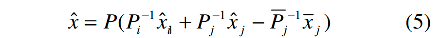

**Error covariance:**

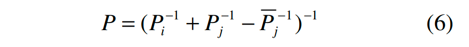

其中：

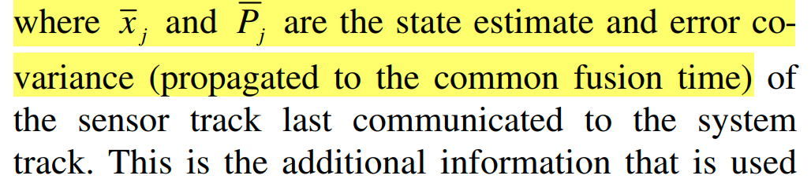

> 需要保存上一次关联的该传感器的状态，然后等到本周期再次关联到该传感器时，将上一时刻的传感器update到本时刻，然后减去相关状态

优劣势：

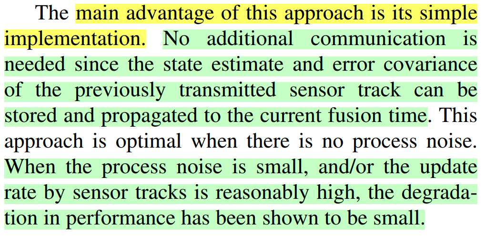

---

#### Equivalent Measurement
> This algorithm de-correlates the sensor track by
finding an equivalent measurement for the “tracklet”,
i.e., the sensor measurements in the sensor track since
the last communication with the system track

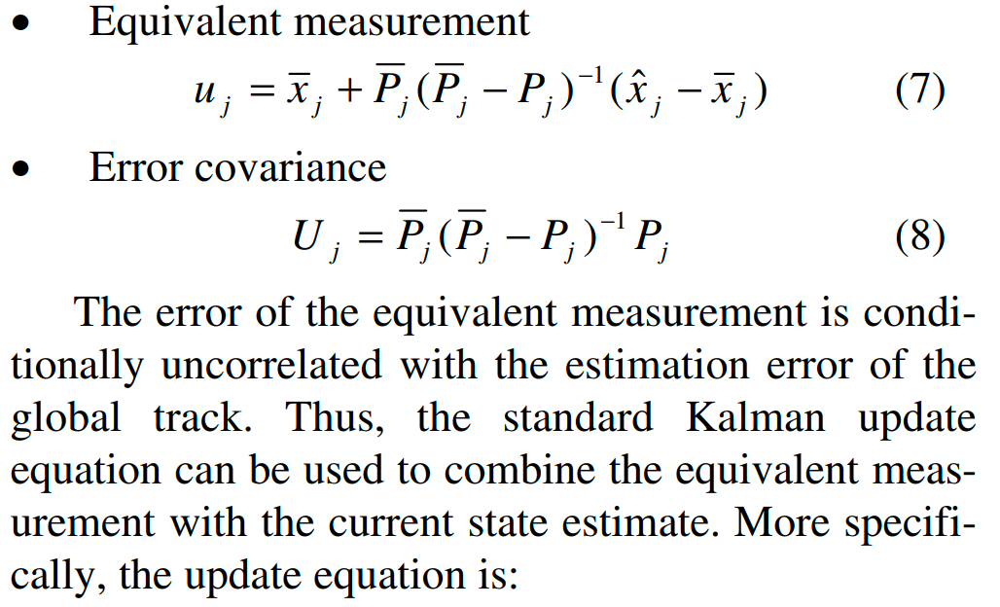

**State estimate:**

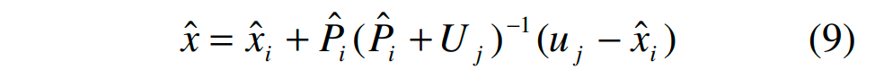

**Error covariance:**

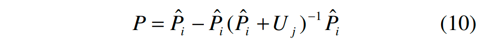

优劣势：
> 同样需要保存上一次关联的该传感器的状态，然后等到本周期再次关联到该传感器时，将上一时刻的传感器update到本时刻，然后减去相关状态