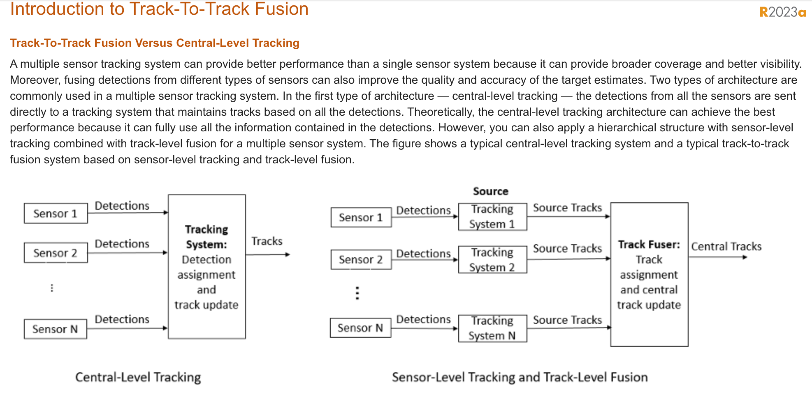
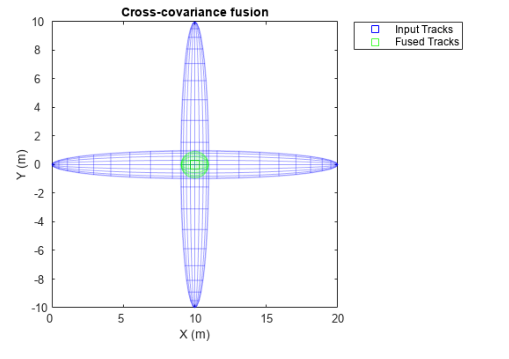

# Contents

## Matlab Demos
  
| 内容 | 概述 | 相关参考 | 备注 |
| :---------: | :---------: | :---------: | :---------: |
| [Introduction to Track-To-Track Fusion](https://ww2.mathworks.cn/help/fusion/ug/introduction-to-track-to-track-fusion.html) |  | [Chong, C. Y., S. Mori, W. H. Barker, and K. C. Chang. "Architectures and Algorithms for Track Association and Fusion."](https://ieeexplore.ieee.org/document/821657) |  |
| [trackFuser](https://ww2.mathworks.cn/help/fusion/ref/trackfuser-system-object.html) |  | [1] Blackman, S. and Popoli, R., 1999. Design and analysis of modern tracking systems(Book).   [2] Chong, Chee-Yee, Shozo Mori, William H. Barker, and Kuo-Chu Chang. "Architectures and algorithms for track association and fusion."    [3] Tian, Xin, Yaakov Bar-Shalom, D. Choukroun, Y. Oshman, J. Thienel, and M. Idan. "Track-to-Track Fusion Architectures-A Review."  | |

## 论文笔记
| 论文 |  相关参考 | 备注 |
| :---------: | :---------: | :---------: |
| [Track-to-Track Fusion With Asynchronous Sensors Using Information Matrix Fusion for Surround Environment Perception](./trace_fusion_IMF.md)   |  | [paper](https://www.semanticscholar.org/paper/Track-to-Track-Fusion-With-Asynchronous-Sensors-for-Aeberhard-Schlichth%C3%A4rle/d0ea6fa1f3fe3988b40d3a4a66c7e1ef4b7b55b0) |