# Track-to-Track Fusion With Asynchronous Sensors Using Information Matrix Fusion for Surround Environment Perception

- [Track-to-Track Fusion With Asynchronous Sensors Using Information Matrix Fusion for Surround Environment Perception](#track-to-track-fusion-with-asynchronous-sensors-using-information-matrix-fusion-for-surround-environment-perception)
  - [融合算法](#融合算法)
  - [Adapted Kalman Filter](#adapted-kalman-filter)
    - [归纳总结](#归纳总结)
  - [Covariance Intersection](#covariance-intersection)
    - [算法流程](#算法流程)
    - [实现细节](#实现细节)
  - [Information Matrix Fusion](#information-matrix-fusion)
    - [流程示意图](#流程示意图)
    - [滤波过程](#滤波过程)
    - [总结](#总结)
  - [附录](#附录)
    - [$\\omega$参数计算:](#omega参数计算)

## 融合算法

## Adapted Kalman Filter
**将局部传感器的航迹视作“measurement”，并使用传统卡尔曼滤波流程。**

部分滤波过程如下：

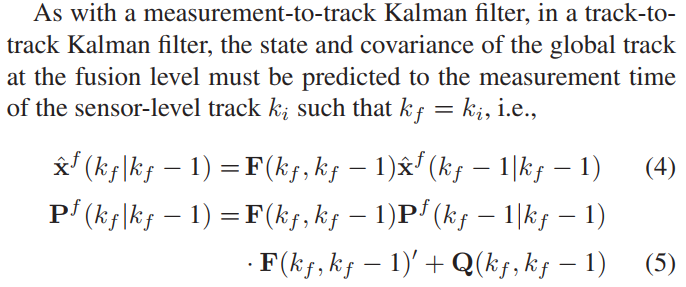

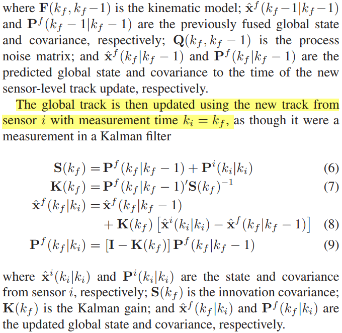

### 归纳总结
**优点：**
> Despite this, using an AKF is an **`easy method`** of accomplishing track-to-track fusion in an S2G fusion strategy and has been used in automotive applications.

**缺点：**
> The AKF algorithm, however, **`completely ignores any correlation between the sensor-level tracks and the global track`**, as measurement updates to a Kalman filter should be independent of one another, which is not the case with already filtered tracks.

## Covariance Intersection
### 算法流程

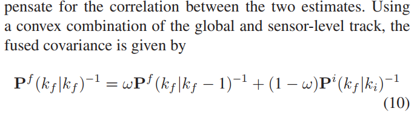

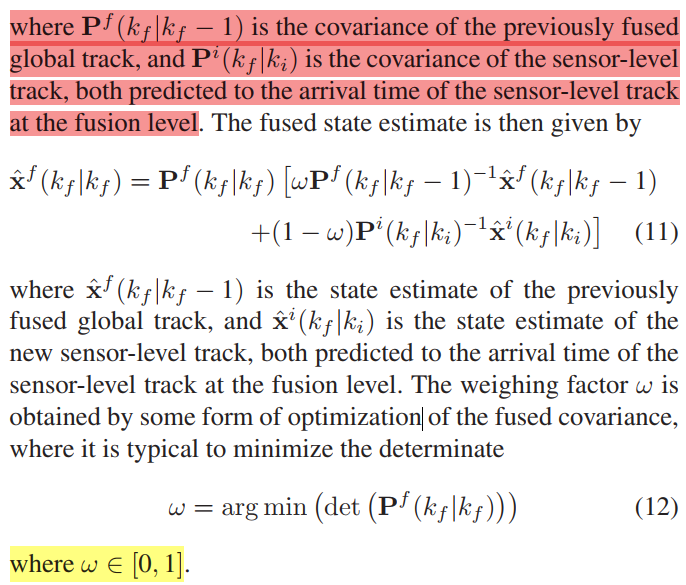

### 实现细节
1. 航迹更新到当前时刻，包括X和P

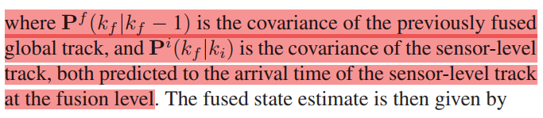

2. 参数$\omega$选择：优化问题

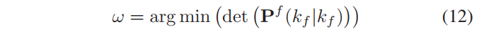

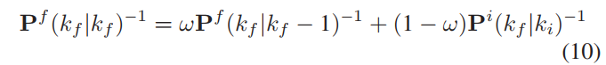

##  Information Matrix Fusion

### 流程示意图

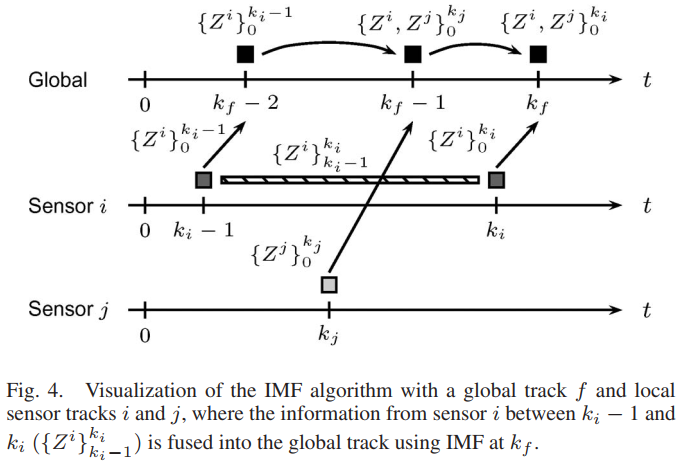

### 滤波过程

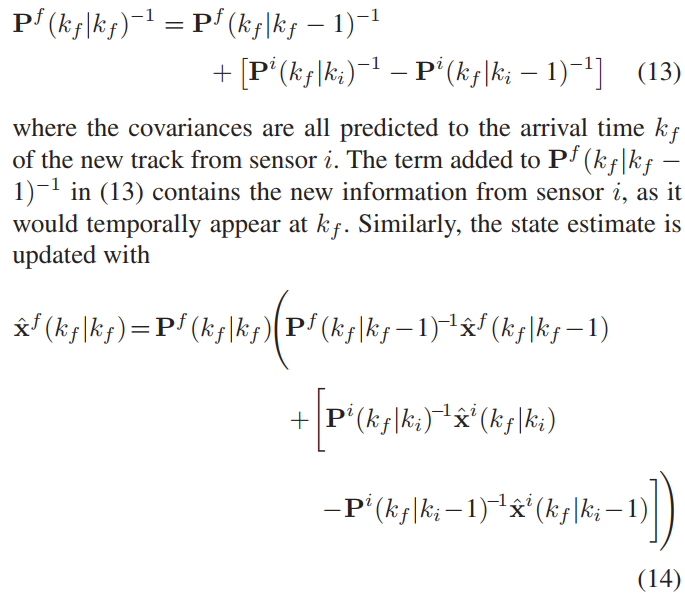

### 总结
1. 同样需要将历史航迹update到当前融合时刻
2. 缺点：需要存储之前融合的local-sensor的历史航迹（对内存有更高的要求）

## 附录
### $\omega$参数计算: 
> 参考论文： Improved Fast Covariance Intersection for Distributed Data Fusion

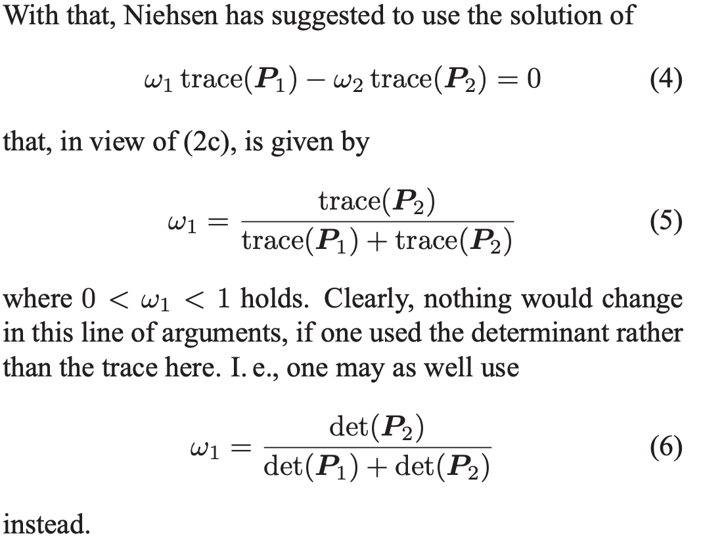

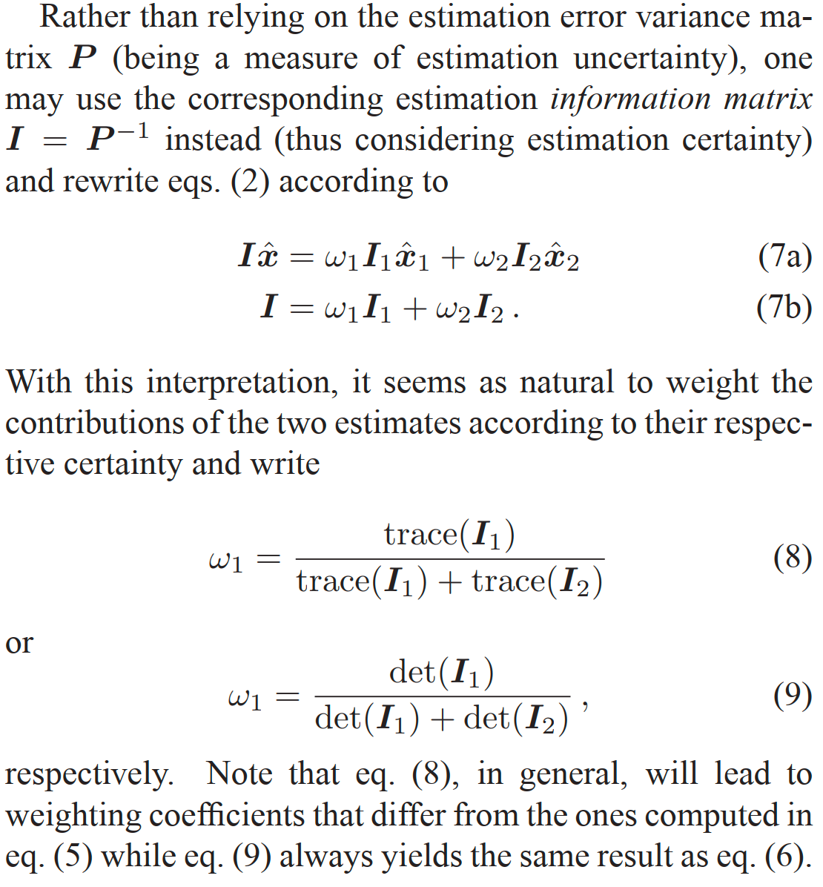

