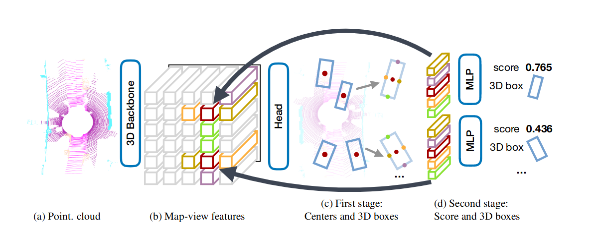

# CenterPoint



> 图2显示了CenterPoint模型的总体框架。
> 
> 第一阶段首先使用backbone_3D（使用voxel或pillar的形式）提取激光雷达点云的BEV特征。 然后，backbone_2D检测头找到对象中心并使用中心特征回归完整的 3D 边界框（中心，长宽高，航向角，速度）。
> 
> 第二阶段是将第一阶段的预测框点特征传递到MLP，去细化置信度score和和3D box。

## 参考解析
[CenterPoint论文和代码解析](https://zhuanlan.zhihu.com/p/584993339)

## OpenpcDet YAML
```yaml
MODEL:
    NAME: CenterPoint

    VFE:
        NAME: MeanVFE

    BACKBONE_3D:
        NAME: VoxelResBackBone8x

    MAP_TO_BEV:
        NAME: HeightCompression
        NUM_BEV_FEATURES: 256

    BACKBONE_2D:
        NAME: BaseBEVBackbone

        LAYER_NUMS: [5, 5]
        LAYER_STRIDES: [1, 2]
        NUM_FILTERS: [128, 256]
        UPSAMPLE_STRIDES: [1, 2]
        NUM_UPSAMPLE_FILTERS: [256, 256]

    DENSE_HEAD:
        NAME: CenterHead
        CLASS_AGNOSTIC: False

        CLASS_NAMES_EACH_HEAD: [
            ['car'], 
            ['truck', 'construction_vehicle'],
            ['bus', 'trailer'],
            ['barrier'],
            ['motorcycle', 'bicycle'],
            ['pedestrian', 'traffic_cone'],
        ]

        SHARED_CONV_CHANNEL: 64
        USE_BIAS_BEFORE_NORM: True
        NUM_HM_CONV: 2
        SEPARATE_HEAD_CFG:
            HEAD_ORDER: ['center', 'center_z', 'dim', 'rot', 'vel']
            HEAD_DICT: {
                'center': {'out_channels': 2, 'num_conv': 2},
                'center_z': {'out_channels': 1, 'num_conv': 2},
                'dim': {'out_channels': 3, 'num_conv': 2},
                'rot': {'out_channels': 2, 'num_conv': 2},
                'vel': {'out_channels': 2, 'num_conv': 2},
            }

        TARGET_ASSIGNER_CONFIG:
            FEATURE_MAP_STRIDE: 8
            NUM_MAX_OBJS: 500
            GAUSSIAN_OVERLAP: 0.1
            MIN_RADIUS: 2

        LOSS_CONFIG:
            LOSS_WEIGHTS: {
                'cls_weight': 1.0,
                'loc_weight': 0.25,
                'code_weights': [1.0, 1.0, 1.0, 1.0, 1.0, 1.0, 0.2, 0.2, 1.0, 1.0]
            }

        POST_PROCESSING:
            SCORE_THRESH: 0.1
            POST_CENTER_LIMIT_RANGE: [-61.2, -61.2, -10.0, 61.2, 61.2, 10.0]
            MAX_OBJ_PER_SAMPLE: 500
            NMS_CONFIG:
                NMS_TYPE: nms_gpu
                NMS_THRESH: 0.2
                NMS_PRE_MAXSIZE: 1000
                NMS_POST_MAXSIZE: 83

    POST_PROCESSING:
        RECALL_THRESH_LIST: [0.3, 0.5, 0.7]

        EVAL_METRIC: kitti
```


## 模块解析
[CenterPoint论文和代码解析](./CenterPoint%E8%AE%BA%E6%96%87%E5%92%8C%E4%BB%A3%E7%A0%81%E8%A7%A3%E6%9E%90.pdf)
