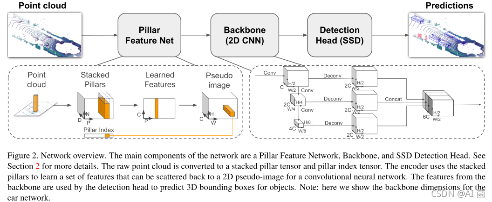
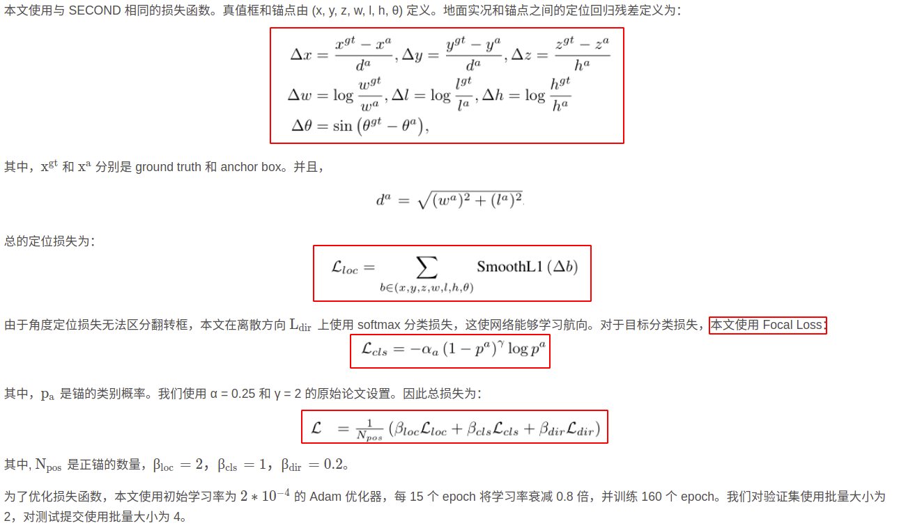

# PointPillars

Code: [CUDA-PointPillars](https://github.com/NVIDIA-AI-IOT/CUDA-PointPillars/tree/main)

Code: [OpenPCDet](https://github.com/hcheng1005/OpenPCDet)

Code：[PointPillars_MultiHead_40FPS](https://github.com/hcheng1005/PointPillars_MultiHead_40FPS)

## 模型总览

### 模型结构

### 损失函数

## 模型解析
[PointPillars解读: 用于点云目标检测的快速编码器](https://blog.csdn.net/wjinjie/article/details/119962121)

[PointPillars论文解析和OpenPCDet代码解析](https://blog.csdn.net/qq_41366026/article/details/123006401)

## OpenpcDet解析
[openpcdet_note](./openpcdet_note.md)

## 模型部署笔记
[部署笔记](./%E9%83%A8%E7%BD%B2%E7%AC%94%E8%AE%B0.md)