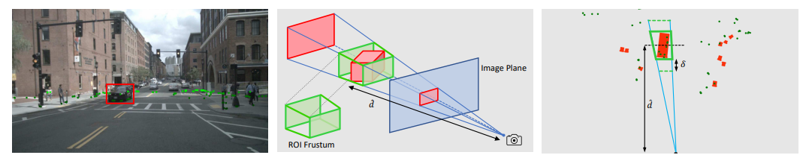
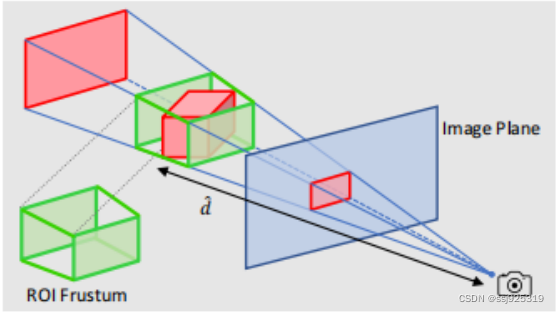
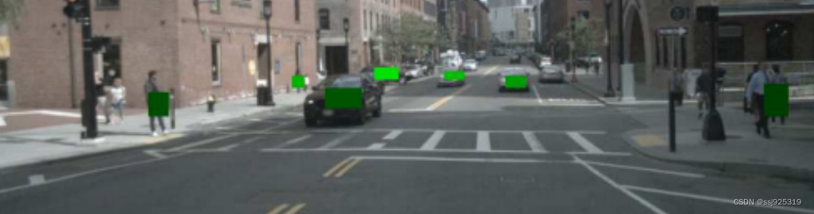

# CenterFusion
> 一种利用雷达和摄像机数据进行三维目标检测的中间融合方法。
> 
Paper: [CenterFusion: Center-based Radar and Camera Fusion for 3D Object Detection](https://arxiv.org/abs/2011.04841)

---

- [概述](#概述)
- [Camera部分](#camera部分)
- [Radar部分](#radar部分)
  - [预处理](#预处理)
  - [**截锥关联**](#截锥关联)

---
# TODO

- [ ] 截锥关联的代码解读与注释
- [ ] C++部署工程实践

---

# 模型结构

## 概述

算法流程：

1. 首先使用**CenterNet算法**进利用摄像头数据预测目标的中心点，并回归得到**目标的3D坐标、深度、旋转等信息**

2. 然后作者将雷达检测到的目标数据和上面检测到的目标中心点进行关联，使用了**视锥的方法**

3. 将**关联后的目标的特征和雷达数据检测到的深度和速度信息组成的特征图并联**，在进行3D目标深度、旋转、速度和属性的回归

其中关键步骤是CenterNet检测结果与雷达点目标的关联，在三维空间视锥法找到对应目标的示意图：

# 模型解读

## Camera部分

- CenterNet中主要提供了三个骨干网络 ResNet-18 (ResNet-101)、**DLA-34**、Hourglass-104

- CenterFusion网络架构在对图像进行初步检测时，**采用CenterNet网络中修改版本的骨干网络DLA**（深层聚合）作为全卷积骨干网，来提取图像特征，因为DLA网络大大减少了培训时间，同时提供了合理的性能再回归图像特征来预测图像上的目标中心点，以及目标的2D大小（宽度和高度）、中心偏移量、3D尺寸、深度和旋转
  
- 主要回归头的组成：256个通道的3×3卷积层、1×1卷积层。这为场景中每个被检测到的对象提供了一个精确的2D边界框以及一个初步的3D边界框.

## Radar部分

### 预处理
- 首先，将毫米波雷达点云转换至图像坐标系，并删除像素外的点云；
  - 相关代码位置：generic_dataset.py -> _load_pc_data
  
- 此次，由于原本的雷达点云没有高度信息，因此作者对点云进行**支柱扩张**处理，就是将每个雷达点云构造成一个个体柱pillars（默认参数：1.5, 0.5, 0.5）；
  - 相关代码位置：generic_dataset.py -> _process_pc
  
- 最后，构造**雷达点云heatmap信息**
  - 相关代码位置：generic_dataset.py -> _process_pc

### **截锥关联**

- **第1步**：利用图像平面中对象的2D边界框及其估计深度和大小，为对象创建一个3D感兴趣区域（RoI）截锥。
  
- **第2步**：对于每一个与物体相关的雷达检测，我们生成三个以物体的二维包围框为中心并在其内部的热图通道，热图的宽度和高度与物体的 2D 边界框成比例，并由参数α控制其中热图值是归一化对象深度d，也是自中心坐标系中径向速度vx和vy的x和y分量。
  
- **第3步**：两个物体的热图区域重叠，深度值较小的那个占优势，因为只有最近的物体在图像中是完全可见的，如下图所示
  
  

- 生成的热图然后连接到图像特征作为额外的通道，这些特征被用作二次回归头的输入，以重新计算对象的深度和旋转，以及速度和属性二次回归头由3个卷积层(3×3核)和1×1卷积层组成，以产生所需的输出。

# 参考链接
- [CenterFusion 项目网络架构详细论述](https://blog.csdn.net/ssj925319/article/details/124669234)
  