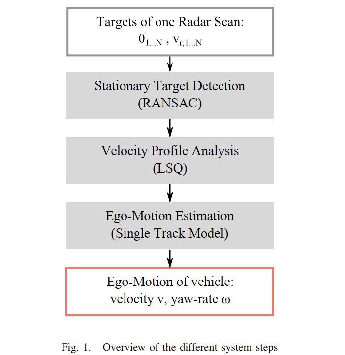
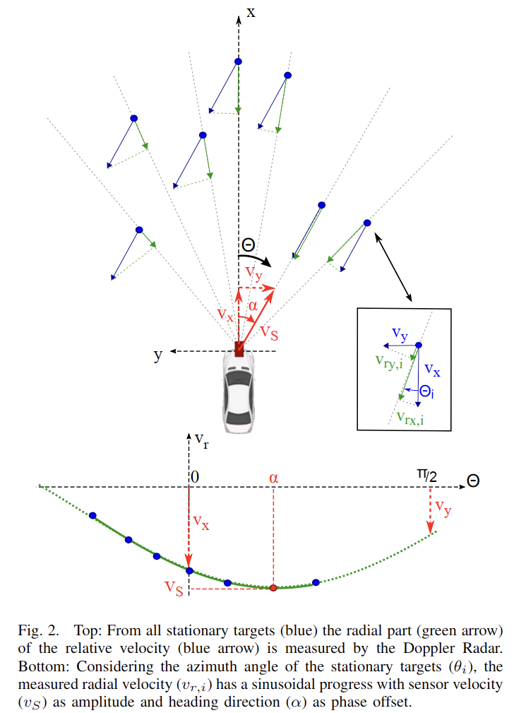
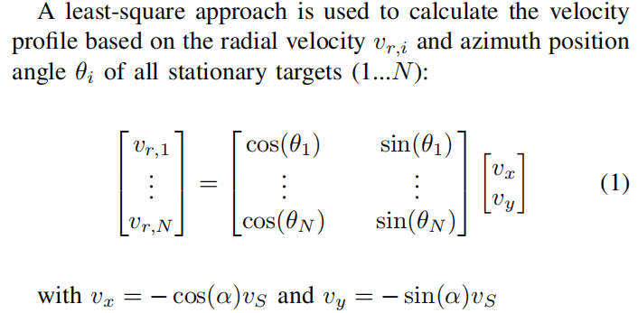
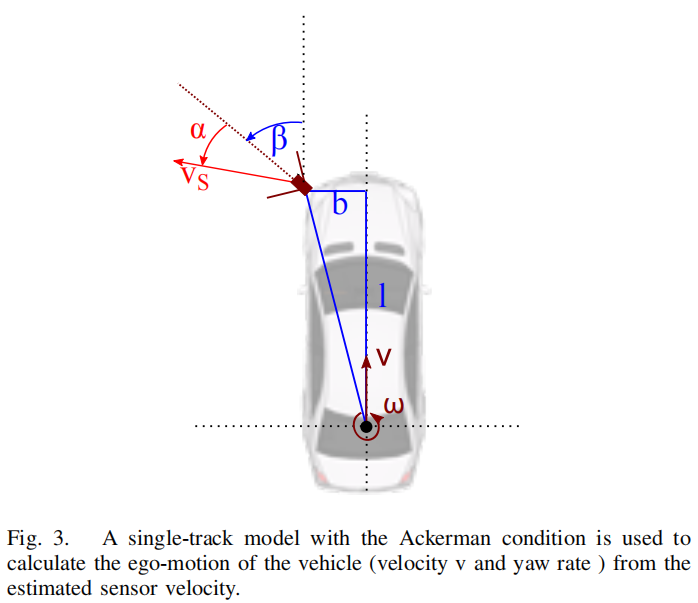
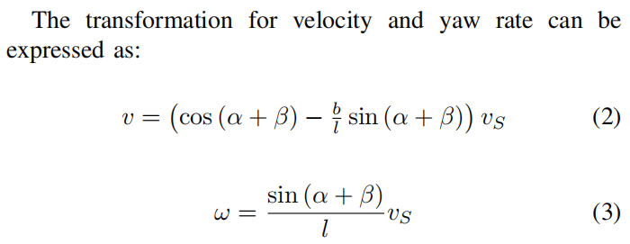

# Ego Motion Estimation

- [算法介绍](#算法介绍)
- [Velocity Profile Analysis](#velocity-profile-analysis)
- [静态点提取](#静态点提取)
- [sensor speed](#sensor-speed)
- [车身状态估计](#车身状态估计)

本文介绍如何使用多普勒毫米波雷达进行载体信息估计，包括载体速度$v$和角速度yaw-rate($w$)。

### 算法介绍

### Velocity Profile Analysis

在使用毫米波雷达时，**静态目标和运动目标以及载体状态，三者存在如下分布关系**：

不同目标的速度-角度的分布曲线如上图所示。

在进行对载体运动状态估计之前，首先要进行**静态点选取**。

### 静态点提取

以实际路测数据为例，我们绘制多普勒-角度分布图：

明显可以看出曲线部分就是后面需要提取的静态点。

如何进行上述静态点的有效提取？本文引入[**随机采样一致性算法（RANSAC）**](../数学\RANSAC.md)。

### sensor speed 
当完成静态点云的挑选之后，就要进行传感器速度的计算。
此处我们建立如下方程：

直接使用[**最小二乘法**](../数学/最小二乘法.md)进行求解得到$v_x$和$v_y$，进而得到$v_s = \sqrt{v_x^2 + v_y^2}$

### 车身状态估计

传感器速度和车身状态的关系如下：

## 参考论文
- [Instantaneous Ego-Motion Estimation using Doppler Radar](./pdfs/Instaneous_ego-motion_estimation_using_Doppler_Radar.pdf)
