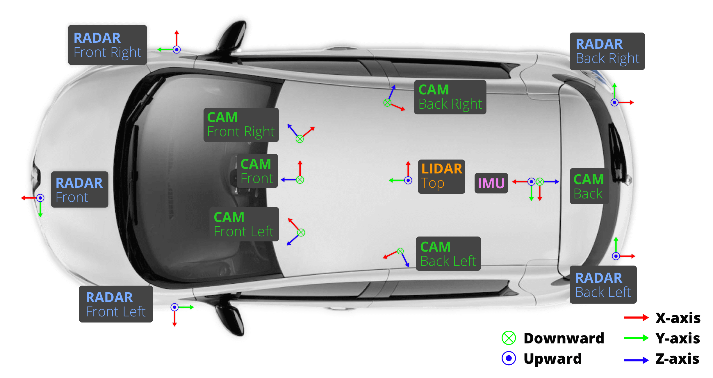
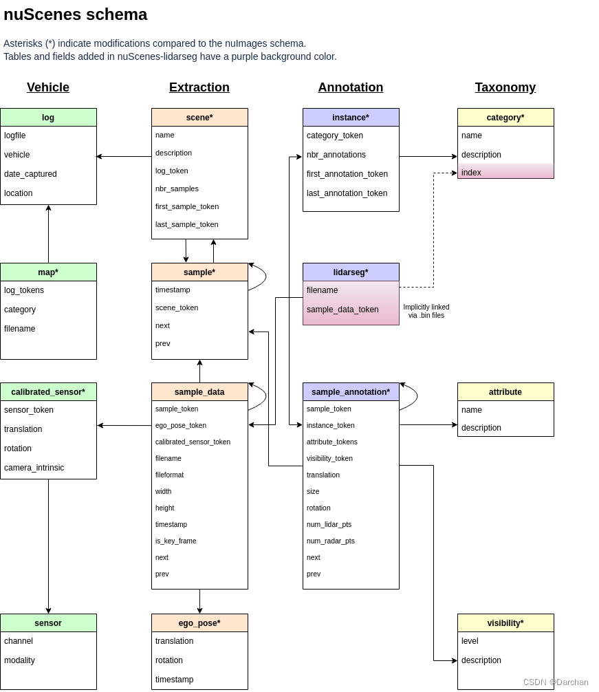

# nuscenes数据集基础使用手册

- [nuscenes数据集基础使用手册](#nuscenes数据集基础使用手册)
  - [简介](#简介)
  - [数据格式](#数据格式)
    - [attribute 属性](#attribute-属性)
    - [calibrated\_sensor 标定的传感器](#calibrated_sensor-标定的传感器)
    - [category 类别](#category-类别)
    - [ego\_pose 自身姿态](#ego_pose-自身姿态)
    - [instance 实例](#instance-实例)
    - [lidarseg 雷达分割](#lidarseg-雷达分割)
    - [log 日志](#log-日志)
    - [map 地图](#map-地图)
    - [**sample 样本**](#sample-样本)
    - [**sample\_annotation 样本标注**](#sample_annotation-样本标注)
    - [**sample\_data 样本数据**](#sample_data-样本数据)
    - [scene 场景](#scene-场景)
    - [sensor 传感器](#sensor-传感器)
    - [visibility 可见性](#visibility-可见性)
  - [基本使用](#基本使用)


## 简介
nuScenes的数据采集主要在波士顿和新加坡进行，用于采集的车辆装备了1个旋转雷达（spinning LIDAR），5个远程雷达传感器（long range RADAR sensor）和6个相机（camera）。

<div align=center>

</div>

> 为了在 LIDAR 和摄像头之间实现良好的跨模态数据对齐，当顶部 LIDAR 扫过摄像头 FOV 的中心时，会触发摄像头的曝光。图像的时间戳为曝光触发时间；而激光雷达扫描的时间戳是当前激光雷达帧实现全旋转的时间。鉴于相机的曝光时间几乎是瞬时的，这种方法通常会产生良好的数据对齐。 请注意，相机以 12Hz 运行，而 LIDAR 以 20Hz 运行。 12 次相机曝光尽可能均匀地分布在 20 次激光雷达扫描中，因此并非所有激光雷达扫描都有相应的相机帧。 将摄像头的帧速率降低到 12Hz 有助于降低感知系统的计算、带宽和存储需求。

**各传感器参数如下表：**

> （1）6个相机的分辨率都是1600x900，除了背后的相机FOV为110度，其他的5个相机的FOV为70度，前置相机和侧面的相机的视野中线角度为55度。也就是说相机覆盖了360度，但是会有重叠部分。相机的采集速率是12Hz。

> （2）用了一个32线的LiDAR。采集速率是20Hz。注意到nuScenes的采集速度是很快的(KITTI是2Hz，Waymo是10Hz)

> (3)毫米波雷达为ARS408，采集速率是13HZ。


## 数据格式

文中描述了 nuScenes 中使用的数据库模式，由多个json文件组成。所有标注和元数据（包括校准、地图、车辆坐标等）都包含在关系数据库中。在数据库表中，每一行都可以通过其唯一的主键标记来标识。

<div align=center>

</div>

### attribute 属性
属性是实例的属性，在类别保持不变的情况下可以更改。

eg. 正在停放/停止/移动的车辆，以及自行车是否有骑手。

```
attribute {
   "token":                   <str> -- 唯一记录标识符.
   "name":                    <str> -- 属性名字.
   "description":             <str> -- 属性描述.
}
```
ex.
```json
{
"token": "cb5118da1ab342aa947717dc53544259",
"name": "vehicle.moving",
"description": "Vehicle is moving."
},
```

### calibrated_sensor 标定的传感器
在特定车辆上校准的特定传感器（激光雷达/雷达/相机）。所有外参都是相对于自车框架给出的。所有相机图像都没有失真和校正。

```
calibrated_sensor {
   "token":                   <str> -- 唯一记录标识符.
   "sensor_token":            <str> -- 指向传感器类型的外部键.
   "translation":             <float> [3] -- 坐标系平移x，y，z，单位m.
   "rotation":                <float> [4] -- 坐标系旋转w，x，y，z.
   "camera_intrinsic":        <float> [3, 3] -- 相机内存，传感器没有则为空.
}
```

ex.
```json
{
"token": "f8d0aaa1a8234ba3aeed5867e0aa81aa",
"sensor_token": "2f7ad058f1ac5557bf321c7543758f43",
"translation": [
1.5508477543,
-0.493404796419,
1.49574800619
],
"rotation": [
0.2060347966337182,
-0.2026940577919598,
0.6824507824531167,
-0.6713610884174485
],
"camera_intrinsic": [
[
1260.8474446004698,
0.0,
807.968244525554
],
[
0.0,
1260.8474446004698,
495.3344268742088
],
[
0.0,
0.0,
1.0
]
]
},
```

### category 类别

物体类别的分类（例如车辆、人类），子类别由句号划分（例如 human.pedestrian.adult）。
```
category {
   "token":                   <str> -- 唯一记录标识符.
   "name":                    <str> -- 分类名称。 按句号划分子类别.
   "description":             <str> -- 类别描述.
   "index":                   <int> -- nuScenes-lidarseg 的 .bin 标签文件中出于效率原因使用的标签的索引，该字段以前不存在.
}
```

ex.
```json
{
"token": "6a5888777ca14867a8aee3fe539b56c4",
"name": "human.pedestrian.stroller",
"description": "Strollers. If a person is in the stroller, include in the annotation."
},
```

### ego_pose 自身姿态
车辆本身在特定时间戳的姿势，相对于日志地图的全局坐标系。

自身位姿 是我们论文中描述的基于激光雷达地图的定位算法的输出，定位在 x-y 平面上是二维的。

```
ego_pose {
   "token":                   <str> -- 唯一记录标识符.
   "translation":             <float> [3] -- 坐标系平移: x, y, z. z一直为0.
   "rotation":                <float> [4] -- 坐标系旋转四元数: w, x, y, z.
   "timestamp":               <int> -- Unix 时间戳.
}
```

ex.
```json
{
"token": "5ace90b379af485b9dcb1584b01e7212",
"timestamp": 1532402927814384,
"rotation": [
0.5731787718287827,
-0.0015811634307974854,
0.013859363182046986,
-0.8193116095230444
],
"translation": [
410.77878632230204,
1179.4673290964536,
0.0
]
},
```

### instance 实例
一个对象实例，例如： 特定车辆。该表是我们观察到的所有对象实例的枚举，请注意，不会跨场景跟踪实例。

```
instance {
   "token":                   <str> -- 唯一记录标识符.
   "category_token":          <str> -- 指向物体类别的外部键.
   "nbr_annotations":         <int> -- 该实例的标注数目.
   "first_annotation_token":  <str> -- Foreign key. Points to the first annotation of this instance.
   "last_annotation_token":   <str> -- Foreign key. Points to the last annotation of this instance.
}
```

ex.
```json
{
"token": "48d58b69b40149aeb2e64aa4b1a9192f",
"category_token": "1fa93b757fc74fb197cdd60001ad8abf",
"nbr_annotations": 30,
"first_annotation_token": "6b89da9bf1f84fd6a5fbe1c3b236f809",
"last_annotation_token": "2f69a953ed424deaa2a89ff4cd515c51"
},
```


### lidarseg 雷达分割
nuScenes-lidarseg 标注和与关键帧的激光雷达点云之间的映射。
```
lidarseg {
   "token":                   <str> -- 唯一记录标识符.
   "filename":                <str> -- 包含 nuScenes-lidarseg 标签的 .bin 文件的名称。使用 numpy 以二进制格式存储的 uint8 的 numpy 数组.
   "sample_data_token":       <str> -- 外部关键字。 Sample_data 对应于带有 is_key_frame=True 注释的激光雷达点云. 
}
```

### log 日志
数据提取内容的日志信息。
```
log {
   "token":                   <str> -- 唯一记录标识符.
   "logfile":                 <str> -- 日志文件名字.
   "vehicle":                 <str> -- 车辆名字.
   "date_captured":           <str> -- 日期(YYYY-MM-DD).
   "location":                <str> -- 捕获日志的位置.
}
```

ex.
```json
{
"token": "7e25a2c8ea1f41c5b0da1e69ecfa71a2",
"logfile": "n015-2018-07-24-11-22-45+0800",
"vehicle": "n015",
"date_captured": "2018-07-24",
"location": "singapore-onenorth"
},
```


### map 地图
地图数据是俯视图，二进制语义掩码的数据。

```
map {
   "token":                   <str> -- 唯一记录标识符..
   "log_tokens":              <str> [n] -- 外部的键.
   "category":                <str> -- 地图类别，目前只有可行驶的表面和人行道的先验语义.
   "filename":                <str> -- 相对于地图掩码文件的相对路径.
}
```

ex.
```json
{
"category": "semantic_prior",
"token": "53992ee3023e5494b90c316c183be829",
"filename": "maps/53992ee3023e5494b90c316c183be829.png",
"log_tokens": [
"0986cb758b1d43fdaa051ab23d45582b",
"1c9b302455ff44a9a290c372b31aa3ce",
"e60234ec7c324789ac7c8441a5e49731",
"46123a03f41e4657adc82ed9ddbe0ba2",
"a5bb7f9dd1884f1ea0de299caefe7ef4",
"bc41a49366734ebf978d6a71981537dc",
"f8699afb7a2247e38549e4d250b4581b",
"d0450edaed4a46f898403f45fa9e5f0d",
"f38ef5a1e9c941aabb2155768670b92a",
"7e25a2c8ea1f41c5b0da1e69ecfa71a2",
"ddc03471df3e4c9bb9663629a4097743",
"31e9939f05c1485b88a8f68ad2cf9fa4",
"783683d957054175bda1b326453a13f4",
"343d984344e440c7952d1e403b572b2a",
"92af2609d31445e5a71b2d895376fed6",
"47620afea3c443f6a761e885273cb531",
"d31dc715d1c34b99bd5afb0e3aea26ed",
"34d0574ea8f340179c82162c6ac069bc",
"d7fd2bb9696d43af901326664e42340b",
"b5622d4dcb0d4549b813b3ffb96fbdc9",
"da04ae0b72024818a6219d8dd138ea4b",
"6b6513e6c8384cec88775cae30b78c0e",
"eda311bda86f4e54857b0554639d6426",
"cfe71bf0b5c54aed8f56d4feca9a7f59",
"ee155e99938a4c2698fed50fc5b5d16a",
"700b800c787842ba83493d9b2775234a"
]
},
```

### **sample 样本** 
样本是 2 Hz 带标注的关键帧。 数据是单个 LIDAR 的一次扫描，认为该次扫描时间戳非常接近。

```
sample {
   "token":                   <str> -- 唯一记录标识符.
   "timestamp":               <int> -- Unix 时间戳.
   "scene_token":             <str> -- 指向场景的外部键.
   "next":                    <str> -- 外部键. 接下来时间的样本. 场景结尾位置为空.
   "prev":                    <str> -- 外部键. 前一刻时间的样本. 场景开始位置为空.
   "data":                    <dict> -- 关键帧中的数据，内含有RADAR、LIDAR、CAM数据的token
   "anns":                    <list> -- 标注框。
}
```
ex.
```json
{
"token": "d7387fb5a21d40a990a5842cca61af1c",
"timestamp": 1535385100898103,
"prev": "baaa60749cd04db7952fd8f4ef8ac837",
"next": "252b65dd79ce4712af1b898b64ea3b98",
"scene_token": "bebf5f5b2a674631ab5c88fd1aa9e87a"
},
```

> 注意：**data 、anns**为新增属性，官方文档中省略未提 或者 暂未更新。

### **sample_annotation 样本标注**
定义样本中所见对象位置的边界框，所有位置数据都是相对于全局坐标系给出的。

```
sample_annotation {
   "token":                   <str> -- 唯一记录标识符.
   "sample_token":            <str> -- 外部键.注意：这指向一个样本而不是样本数据，因为注释是在样本级别完成的，考虑到所有相关的样本数据.
   "instance_token":          <str> -- 实例键. 此标注属于哪个对象实例，随着时间的推移，一个实例可以有多个注释.
   "attribute_tokens":        <str> [n] -- 属性键. 标注的属性列表，属性会随着时间而改变，所以它们属于这里，而不是在实例表中.
   "visibility_token":        <str> -- 可见性键. 可见性也可能随时间而改变，如果没有标注可见性，则标记为空字符串.
   "translation":             <float> [3] -- 包围盒中心位置： center_x, center_y, center_z.
   "size":                    <float> [3] -- 包围盒的尺寸： width, length, height.
   "rotation":                <float> [4] -- 包围盒的旋转: w, x, y, z.
   "num_lidar_pts":           <int> -- 盒子中的激光点数. 该样本中雷达扫描识别的点数.
   "num_radar_pts":           <int> -- 盒子中毫米波雷达点数，该样本中毫米波雷达扫描识别的点数，这个数字是所有毫米波传感器的总和，没有过滤任何无效点.
   "next":                    <str> -- 外部键. 下一时刻来自同一个对象实例的样本注释，如果这是此对象的最后一个注释，则为空.
   "prev":                    <str> -- 外部键. 上一时刻来自同一个对象实例的样本注释，如果这是此对象的第一个注释，则为空.
   "category_name":           <str> -- 类别名称.例如如下形式：'human.pedestrian.adult'
}
```

ex.
```json
{
"token": "70aecbe9b64f4722ab3c230391a3beb8",
"sample_token": "cd21dbfc3bd749c7b10a5c42562e0c42",
"instance_token": "6dd2cbf4c24b4caeb625035869bca7b5",
"visibility_token": "4",
"attribute_tokens": [
"4d8821270b4a47e3a8a300cbec48188e"
],
"translation": [
373.214,
1130.48,
1.25
],
"size": [
0.621,
0.669,
1.642
],
"rotation": [
0.9831098797903927,
0.0,
0.0,
-0.18301629506281616
],
"prev": "a1721876c0944cdd92ebc3c75d55d693",
"next": "1e8e35d365a441a18dd5503a0ee1c208",
"num_lidar_pts": 5,
"num_radar_pts": 0
},
```


> 注意：**category_name**为新增属性，官方文档中省略未提 或者 暂未更新。

### **sample_data 样本数据**
传感器数据，例如：图像、点云或毫米波。 对于 is_key_frame=True 的 sample_data，时间戳应该非常接近它指向的样本。 对于非关键帧，sample_data 指向时间最近的样本 sample。

```
sample_data {
   "token":                   <str> -- 唯一记录标识符.
   "sample_token":            <str> -- 样本键. 与其相联系的样本键.
   "ego_pose_token":          <str> -- 自运动键.
   "calibrated_sensor_token": <str> -- 标定传感器键.
   "filename":                <str> -- 硬盘数据块的相对路径.
   "fileformat":              <str> -- 数据文件格式.
   "width":                   <int> -- 图像宽（像素）.
   "height":                  <int> -- 图像高（像素）.
   "timestamp":               <int> -- Unix 时间戳.
   "is_key_frame":            <bool> -- 如果样本数据是关键帧则为真, 否则为假.
   "next":                    <str> -- 下一帧外部键. 下一时刻来自同传感器的样本数据. 如果是场景结束则为空.
   "prev":                    <str> -- 上一帧外部键. 上一时刻来自同传感器的样本数据. 如果是场景开始则为空.
   "sensor_modality":         <str> -- 传感器模态，如lidar
   "channel":                 <str> -- 通道，如LIDAR_TOP
}
```

ex.
```json
{
"token": "5ace90b379af485b9dcb1584b01e7212",
"sample_token": "39586f9d59004284a7114a68825e8eec",
"ego_pose_token": "5ace90b379af485b9dcb1584b01e7212",
"calibrated_sensor_token": "f4d2a6c281f34a7eb8bb033d82321f79",
"timestamp": 1532402927814384,
"fileformat": "pcd",
"is_key_frame": false,
"height": 0,
"width": 0,
"filename": "sweeps/RADAR_FRONT/n015-2018-07-24-11-22-45+0800__RADAR_FRONT__1532402927814384.pcd",
"prev": "f0b8593e08594a3eb1152c138b312813",
"next": "978db2bcdf584b799c13594a348576d2"
},
```

> 注意：**sensor_modality、channel**为新增属性，官方文档中省略未提 或者 暂未更新。

### scene 场景
场景是从日志中提取的 20 秒长的连续帧序列， 多个场景可以来自同一个日志。 

请注意，物体对象身份（实例标记）不会跨场景保留。
```
scene {
   "token":                   <str> -- 唯一记录标识符.
   "name":                    <str> -- 短字符串标识符.
   "description":             <str> -- 场景更详尽的描述.
   "log_token":               <str> -- 日志键. 指向数据提取位置的日志.
   "nbr_samples":             <int> -- 场景中样本数量.
   "first_sample_token":      <str> -- 第一样本键，指向场景中的第一个样本.
   "last_sample_token":       <str> -- 最终样本键，指向场景中的最后一个样本.
}
```

ex.
```json
{
"token": "cc8c0bf57f984915a77078b10eb33198",
"log_token": "7e25a2c8ea1f41c5b0da1e69ecfa71a2",
"nbr_samples": 39,
"first_sample_token": "ca9a282c9e77460f8360f564131a8af5",
"last_sample_token": "ed5fc18c31904f96a8f0dbb99ff069c0",
"name": "scene-0061",
"description": "Parked truck, construction, intersection, turn left, following a van"
},
```


### sensor 传感器
一种具体的传感器类型
```
sensor {
   "token":                   <str> -- 唯一记录标识符.
   "channel":                 <str> -- 传感器通道名称.
   "modality":                <str> {camera, lidar, radar} -- 传感器模式，支持括号中的类别.
}
```

ex.
```json
{
"token": "725903f5b62f56118f4094b46a4470d8",
"channel": "CAM_FRONT",
"modality": "camera"
},
{
"token": "ce89d4f3050b5892b33b3d328c5e82a3",
"channel": "CAM_BACK",
"modality": "camera"
},
```

### visibility 可见性
实例的可见性是在所有 6 个图像中可见的注释部分，分为 0-40%、40-60%、60-80% 和 80-100% 的 4 个容器。
```
visibility {
   "token":                   <str> -- 唯一记录标识符.
   "level":                   <str> -- 可见性等级.
   "description":             <str> -- 可见性等级描述.
}
```

## 基本使用
[click_me](./demo/README.md)