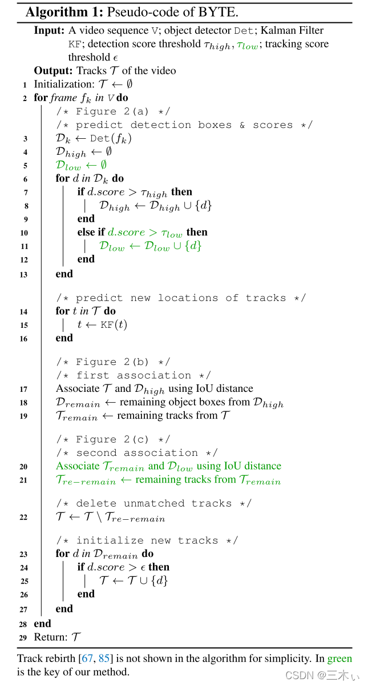
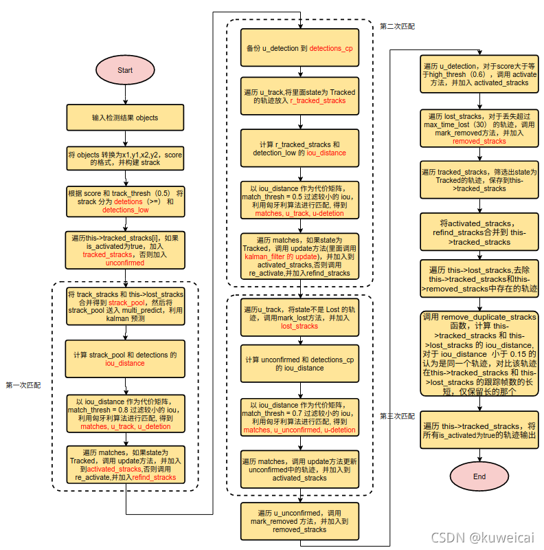

# ByteTrack (Camera)

Paper: [ByteTrack: Multi-Object Tracking by Associating Every Detection Box](https://arxiv.org/abs/2110.06864)

Code: https://github.com/ifzhang/ByteTrack

---

- [ByteTrack (Camera)](#bytetrack-camera)
  - [摘要](#摘要)
  - [算法原理](#算法原理)
    - [二阶段关联策略概括](#二阶段关联策略概括)
    - [伪代码流程和解读](#伪代码流程和解读)
  - [总流程一览](#总流程一览)
  - [附录](#附录)

## 摘要

ByteTrack是基于tracking-by-detection范式的跟踪方法。大多数多目标跟踪方法通过关联分数高于阈值的检测框来获取目标ID。对于检测分数较低的目标，例如遮挡目标，会被简单的丢弃，这带来了不可忽略的问题，包括大量的漏检和碎片化轨迹。为了解决该问题，作者提出了一种简单、高效且通用的数据关联方法BYTE，通过关联每个检测框而不仅仅是高分检测框来进行跟踪。对于低分检测框，利用它们与轨迹的相似性来恢复真实目标并过滤掉背景检测。

## 算法原理

其他内容和标准MOT框架一致，不再重复。

重点关注论文提出的二阶段关联策略：

### 二阶段关联策略概括
- 1）BYTE会将每个检测框根据得分分成两类，高分框和低分框，**总共进行两次匹配**。

- 2）**第一次使用高分框和之前的跟踪轨迹进行匹配**。

- 3）**第二次使用低分框和第一次没有匹配上高分框的跟踪轨迹**（例如在当前帧受到严重遮挡导致得分下降的物体）进行匹配。

- 4）**对于没有匹配上跟踪轨迹，得分又足够高的检测框，我们对其新建一个跟踪轨迹**。对于没有匹配上检测框的跟踪轨迹，我们会保留30帧，在其再次出现时再进行匹配。

### 伪代码流程和解读

首先，算法的输入由一个视频片段$V$，相应的还有一个检测器$Det$和一个卡尔曼滤波器$KF$。同时设定三个阈值$\tau _{high}$、 $\tau_{low}$和$\epsilon$。前两个为检测的分数阈值，后一个为追踪得分阈值。BYTE的最终输出为视频的轨迹$\mathcal{T}$，其中的每条轨迹包括目标的检测框和身份。

- （3-13行）：对于所有的由检测器产生的检测框和得分信息，将他们分为两部分，检测得分高于阈值$\tau_{\text {high }}$ 的归类为$\mathcal{D}_{\text {high }}$，同时检测得分高于阈值$\tau_{\text {low }}$且低于阈值$\tau_{\text {high }}$的归类为$\mathcal{D}_{\text {low }}$.
  
- （14-16行）：对于轨迹集合$\mathcal{T}$中的所有轨迹，利用卡尔曼滤波$KF$预测其在当前帧中的坐标。
  
- （17-19行）：首先对高得分的检测$\mathcal{D}_{\text {high }}$和所有轨迹$\mathcal{T}$进行第一次关联。相似度由模型预测和滤波预测的检测框之间的IoU计算，然后利用匈牙利算法进行匹配。对于相似度小于0.2的拒绝匹配。对于未匹配的检测框，存放于$D_{remain}$，未匹配成功的轨迹，存放于$\mathcal{T}_{remain}$。(如果需要，这里也可以加入外貌特征的匹配，如DeepSort。)

- （20-21行）：对于低得分的检测框$D_{low}$和剩余轨迹$\mathcal{T}_{remain}$进行第二次的匹配，未匹配成功的轨迹存放于$\mathcal{T}_{re-remain}$，未匹配的低的分的检测直接删除。（这里作者认为由于遮挡，运动模糊等问题，会造成外貌特征的不准确，所以也依旧使用IoU作为相似度。）

- （22行）：对于$\mathcal{T}_{re-remain}$中的轨迹，认为是暂时丢失了目标，将其放入$\mathcal{T}_{lost}$，如果$\mathcal{T}_{lost}$中轨迹存在超过一定时间（30帧），则从T中删除，否则继续在$\mathcal{T}$中保存。（如果后期匹配到，也会从$\mathcal{T}_{lost}$中将其删除。）

- （23-27行）：对于$D_{remain}$中的检测，如果检测得分高于$\epsilonϵ$且存活超过两帧，则初始化为新的轨迹。

对于每帧的输出，只会输出$\mathcal{T}$关于当前帧的边界框和对应的ID。

## 总流程一览

## 附录
- [Yolox with ByteTrack](https://gitcode.net/lzzzzzzm/yolox_bytetrack)
- [ByteTrack注释详解](http://www.manongjc.com/detail/64-pqvfwkbdkhkwrzu.html)