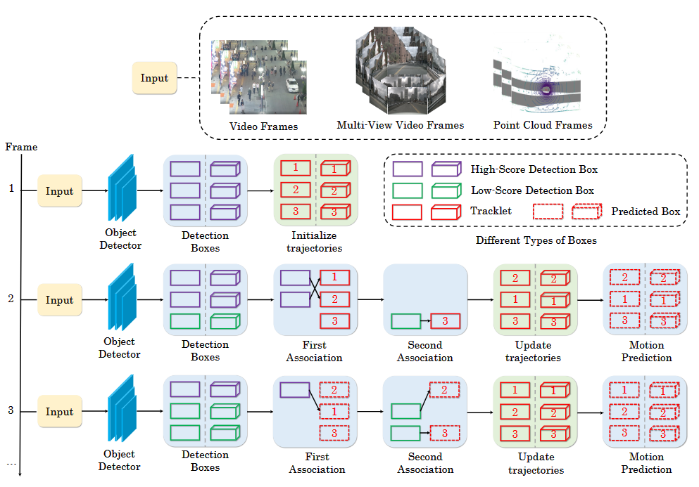
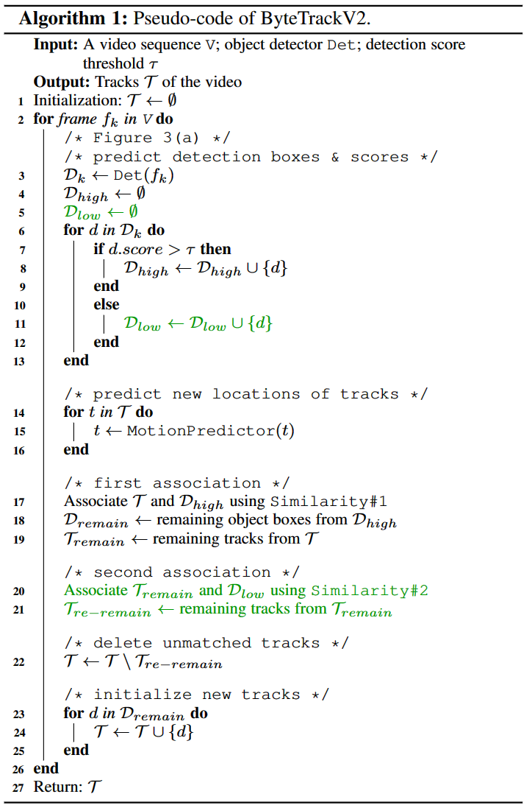
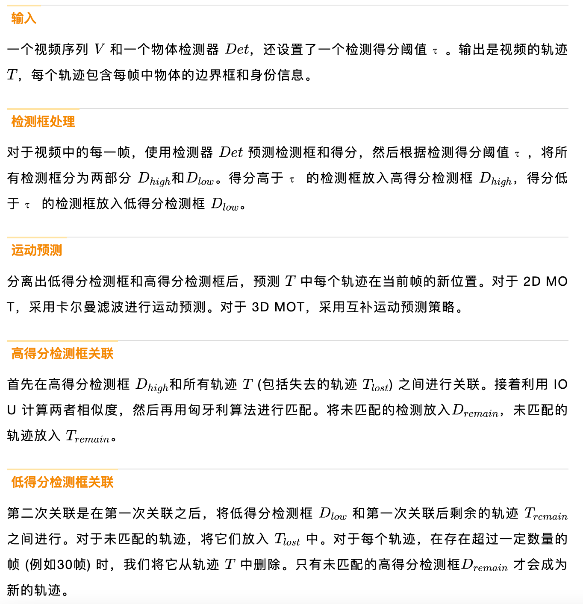

# ByteTrack V2

Paper: https://arxiv.org/pdf/2303.15334.pdf

Code: https://github.com/ifzhang/ByteTrack-V2

---

- [ByteTrack V2](#bytetrack-v2)
  - [前言](#前言)
  - [算法概述](#算法概述)
  - [互补的3D运动预测](#互补的3d运动预测)
  - [统一的2D和3D数据关联](#统一的2d和3d数据关联)
  - [参考链接](#参考链接)

## 前言
- 提出了一种互补的3D运动预测策略，以应对对象的突然运动和短暂消失等问题。通过将检测到的对象速度和卡尔曼滤波器相结合，实现了较为精确的运动预测，从而提高了关联的准确性和跟踪的性能。该方法在处理突发运动或低帧率视频时能够更加鲁棒地预测对象的位置。

- 统一的2D和3D数据关联策略，能够从低分检测框中挖掘出真实的目标，解决了目标漏检和轨迹碎片化等问题。此外，该方法是非参数的，可以与各种检测器相结合，具有广泛的应用前景。

- 在大规模nuScenes数据集上进行了详细实验，检测驱动的分层数据关联和整合的3D运动预测策略在3D场景中得到了验证。ByteTrackV2在相机和LiDAR设置下的nuScenes跟踪任务中均取得了最先进的性能。

## 算法概述
ByteTrackV2 提出了一种检测驱动的分层数据关联策略，充分利用高分数到低分数的检测框。通过使用检测框和轨迹之间的运动相似性，我们可以区分低分数的检测框中的物体和背景。首先，基于运动相似性将高分数检测框与轨迹关联起来。然后，使用相同的运动相似性将未匹配的轨迹与低分数检测框进行第二次关联，以消除背景并恢复真实物体。

如图4所示，ByteTrackV2是一个统一的2D和3DMOT框架，可以用于处理图像、多视图图像或点云数据。该框架首先采用2D/3D 目标检测器获取检测框。**在第一帧中，所有高分检测框都被初始化为轨迹**。**在随后的帧中，先将高分检测框与所有轨迹相关联，然后将低分检测框与未匹配的轨迹相关联**。关联是在运动预测之后的检测框和轨迹之间进行的。最终输出是每帧中更新后的轨迹。

其中，本文使用了**YOLOX作为2D目标检测器**，**PETRv2作为基于图像的3D目标检测器**，**CenterPoint和TransFusion-L作为基于LiDAR的3D目标检测器**。

## 互补的3D运动预测
本文使用了两种运动模型，即**检测速度**和**卡尔曼滤波器**。在短期关联中，采用检测速度来预测物体的短期运动轨迹。在长期关联中，采用卡尔曼滤波器来预测物体的长期运动轨迹。通过这种方式，可以最大化两种运动模型的优势，提高物体跟踪的准确性和鲁棒性。如图5所示，目标消失时，利用卡尔曼滤波器向前预测；目标出现后，利用检测速度向后预测，校验卡尔曼滤波的预测准确性。

在双边预测之后，本文采用了统一的二维和三维数据关联策略。通过计算检测结果和跟踪结果之间的相似度来完成身份分配。此外，为了解决检测框和跟踪框之间的偶发性不重叠问题，本文采用了三维广义交并比 (GIoU) 作为相似度度量。

为了进一步提高物体跟踪的鲁棒性，本文还利用了检测得分来自适应地更新测量不确定性矩阵。通过将检测得分插入到不确定性矩阵中来控制不确定性的大小，从而使卡尔曼滤波器更具鲁棒性

## 统一的2D和3D数据关联
本文提出了一种简单、有效且统一的数据关联方法，适用于2D和3D多目标跟踪。与以前的方法不同，该方法不仅保留高分检测框，还将每个检测框分为高分和低分两类。整个检测驱动的分层数据关联策略pipeline如下所示。

> 在第一帧中，将所有检测框初始化为轨迹。在随后的帧中，首先将高分检测框与轨迹相关联。一些轨迹因未找到合适的高分检测框而未能匹配，通常是由于遮挡、运动模糊或尺寸变化导致的。然后将低分检测框和这些未匹配的轨迹相关联，以恢复低分检测框中的对象并同时过滤掉背景。

伪代码主要步骤如下：

## 参考链接
[华中科大、百度&港大联合出品 | ByteTrackV2](https://mp.weixin.qq.com/s/DVLJ4YkO_3QtU9YxKc85_A)