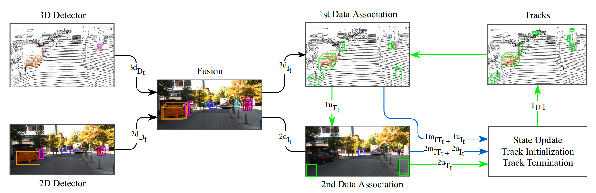
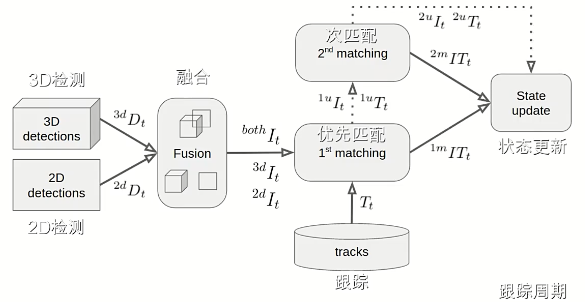
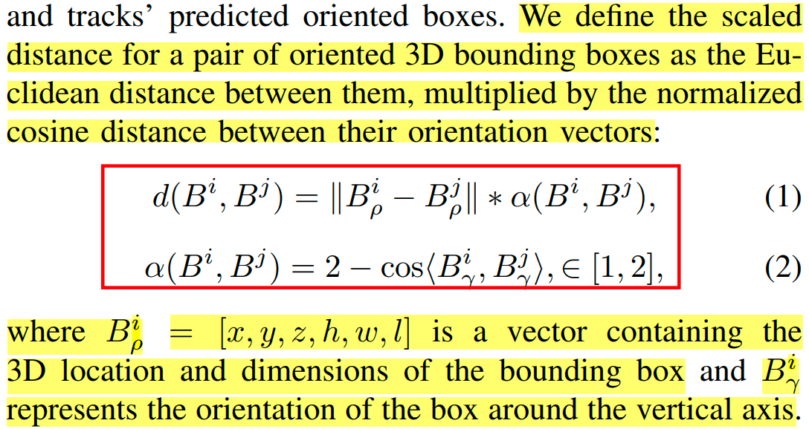
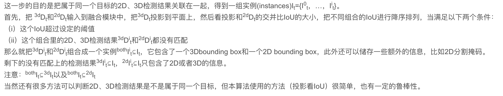

# EagerMOT

Paper: [EagerMOT: 3D Multi-Object Tracking via Sensor Fusion](https://arxiv.org/abs/2104.14682v1)

Code: https://github.com/aleksandrkim61/EagerMOT

视频解说：https://www.youtube.com/watch?v=RX4xDQ0YXxE

---

- [EagerMOT](#eagermot)
  - [简介](#简介)
  - [算法步骤](#算法步骤)
    - [目标检测](#目标检测)
    - [检测融合](#检测融合)
    - [匹配与关联](#匹配与关联)
      - [第一阶段](#第一阶段)
      - [第二阶段](#第二阶段)
    - [状态更新](#状态更新)
    - [生命周期管理](#生命周期管理)
  - [参考链接](#参考链接)

## 简介

现有的方法利用深度传感器（比如激光雷达）来进行3D目标跟踪，但3D点云数据在远处很稀疏，因此感应范围有限。而2D图像数据提供了密集而丰富的视觉信息，有助于定位遥远的物体。所以本文结合3D和2D的数据进行目标跟踪，通过摄像机，可以识别遥远的物体，当物体进入激光雷达感应范围的时候，激光雷达可以进行更精确的定位。

## 算法步骤

### 目标检测

分别使用3D检测模型和2D检测模型对输入的点云数据和图像数据进行目标检测。

> *3D检测结果是三维空间下的bounding box；*
> 
> *2D检测结果是图像坐标系下的box框；*

### 检测融合

对于上述检测结果，我们把属于同一个目标的3D和2D检测框进行融合: 

> 先把3D框投影到2D图像上，然后计算投影后的2D框和原始2D检测器输出的2D框计算IOU，利用贪心匹配，产生一系列同时有2D检测结果和3D检测结果的实例以及单独2D检测结果和单独3D检测结果,这些实例共同组成一个集合It。

> 多相机设置：如果有多个相机的话，会把3D检测结果投影到能被相机拍到的相机（可能有多个都能看到），找到IOU最大的那个相机上的2D检测框进行匹配，不会把一个3D框匹配到多个2D框上.

通过上述步骤，将得到三种结果：
$l_t^{both}$、$l_t^{3D}$、$l_t^{2D}$

> $l_t^{both}$同时包含3D和2D检测框；
> 
> $l_t^{3D}$只包含3D检测框；
> 
> $l_t^{2D}$只包含2D检测框；
   
### 匹配与关联
论文采用二阶段关联过程：

#### 第一阶段
> 本阶段在3D坐标系下进行。

> 匹配算法采用的贪心算法（greedy pair）

代价函数是**欧式距离*归一化的朝向余弦距离**：

经过第一阶段的匹配，还剩下没匹配的3D检测1u_It（无论是否和2D检测关联上）和没匹配的3D跟踪1u_Tt，*但是这些3D检测并不参与第二阶段的匹配*。

*引用外部参考：*

#### 第二阶段
本阶段在图像坐标系下进行。

第二阶段只在2D空间进行匹配。将没有和3D检测关联上的2D检测（3D检测框和2D检测框关联的目的所在），和剩下的没匹配的3D跟踪1u_Tt和所有的2D跟踪2d_Tt，基于2D IoU度量进行匹配（3D跟踪的预测框需要投影到图像上获取2D框）。

有些目标在2D检测结果上有检测框，但是由于距离雷达太远，并不能通过雷达点云获得3D检测框，对于这种情况，2D检测框一般在图像上的位置变化不大，故并不进行2D框位置的预测（类似卡尔曼滤波），直接基于前一帧观测到的2D框进行关联。

### 状态更新
2D状态参数直接用匹配的2D检测框进行更新，且下一帧的当前目标位置直接用当前框，不做预测。

而3D状态，当有3D检测框匹配时，用检测框+卡尔曼滤波器更新当前框位置，且基于匀速运动模型更新下一帧当前目标的3D位置（和AB3DMOT一样），*当没有3D检测框匹配，或者3D跟踪仅有2D检测框和其投影匹配时，按无测量的纯运动估计（卡尔曼滤波）预测下一帧当前目标位置*（也就是只预测，不更新：因为没有量测）。

### 生命周期管理
跟AB3DMOT一样，2D跟踪连续3帧没有2D检测框和其匹配，或者3D跟踪连续3帧没有3D检测框和其3D框匹配且也没有2D检测框和其2D图像上的投影框匹配，则此跟踪认为丢失。

由于3D检测其通常不像2D检测器一样检测地那么准，如果一个3D跟踪之前连续多帧被2D检测框匹配（这个跟踪最初是个3D检测框，但是到后面的帧时并没有3D检测框和其匹配，仅有2D检测框和其2D投影匹配，这个跟踪纯运动更新状态参数好几次，并没被丢弃，因为有2D检测框和其匹配），当前帧时又有3D检测框和其预测框匹配，则认为是跟踪加强了.

## 参考链接
[EagerMOT阅读笔记](https://blog.csdn.net/qq_42575422/article/details/120982453) 

[论文笔记:EagerMOT](https://blog.csdn.net/qq_40498388/article/details/125540571)
