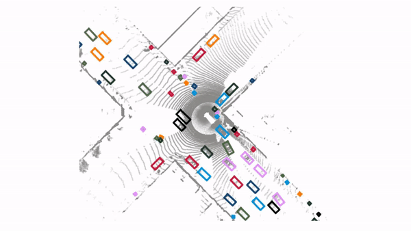
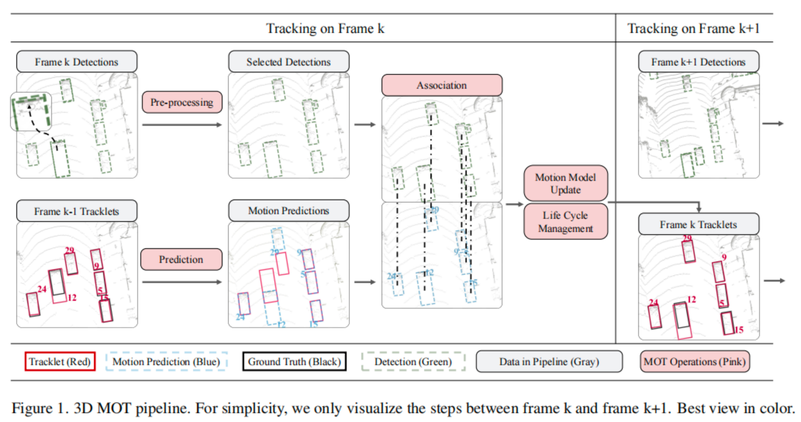
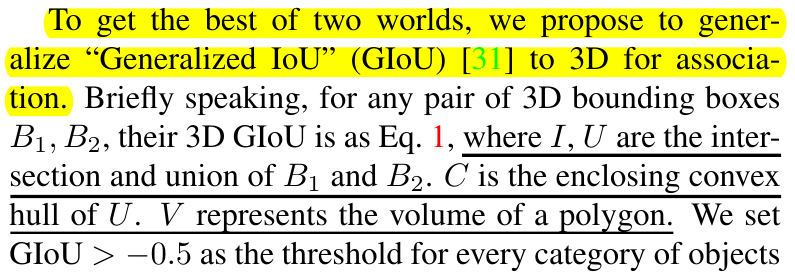
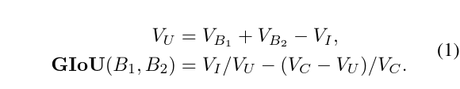
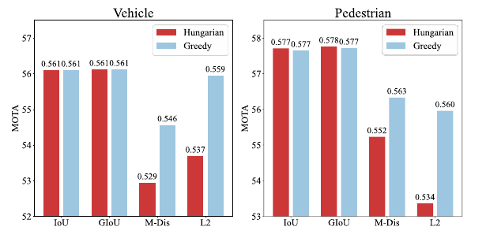
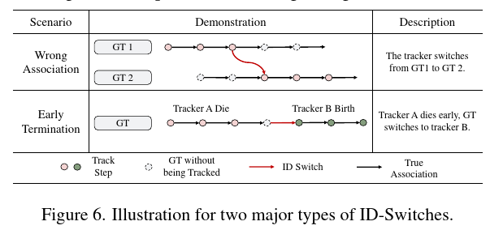
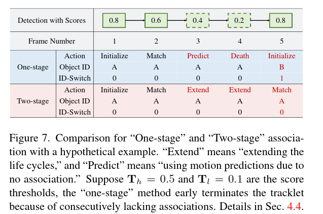

# SimpleTrack: Simple yet Effective 3D Multi-object Tracking


Paper: [here](./pdf/SimpleTrack%20Understanding%20and%20Rethinking%203D%20Multi.pdf)

Code: https://github.com/tusen-ai/SimpleTrack

---

- [SimpleTrack: Simple yet Effective 3D Multi-object Tracking](#simpletrack-simple-yet-effective-3d-multi-object-tracking)
  - [算法框架](#算法框架)
  - [数据预处理](#数据预处理)
  - [关联匹配算法](#关联匹配算法)
    - [匹配分：3D GIOU](#匹配分3d-giou)
    - [匹配策略](#匹配策略)
  - [航迹管理](#航迹管理)
  - [附录](#附录)
    - [MNS](#mns)
    - [部分代码](#部分代码)
    - [3D GIOU](#3d-giou)
  - [参考链接](#参考链接)

---




## 算法框架


在介绍算法框架之前，首先明确滤波算法中的状态向量和观测向量

**状态向量**

$$ 
X = [x, y, z, v_x, v_y, v_z, w, h, l, \theta]
$$

$$ 
Z = [x, y, z, w, h, l, \theta]
$$


## 数据预处理

采用NMS算法对det-box进行处理。


## 关联匹配算法

### 匹配分：3D GIOU

<div align=center>

</div>

<div align=center>

</div>


**其中：**

> VB1和VB2为任意两个3D bboxes体积；
> 
> VI为两者重叠体积(intersection)；
> 
> VU为联合体积(union);
> 
> VC为包络两个bboxes的体积。
  
### 匹配策略
将检测结果和预测结果匹配到一起的方法主要有2种：

- 把匹配问题看作一个二分图匹配问题，用[**匈牙利算法**](../../common/分配算法.md)解决；
- 通过[贪心算法](../../common/分配算法.md)迭代关联最近的配对。
 
**如果关联矩阵选用IoU，那么两种方法都可以；如果关联矩阵选择的是距离，用贪心算法效果更好**。原因可能是基于距离的关联矩阵数值范围很大，因此优化全局最优解的方法，如匈牙利算法，可能会受到异常值的不利影响

<div align=center>

</div>

> *不同目标类型在谁用不同关联分下采用不同匹配策略的结果*

## 航迹管理

<div align=center>

</div>


如上图所示，ID switch发生的原因主要可以分为2种：错误的关联以及提前结束（认为一个追踪着的目标已经消失了，但其实由于遮挡等原因，它并没有真的消失，但却提前把这个目标的轨迹删掉）。而提前结束又是ID switch发生的最主要原因。所以为了解决这个问题，SimTrack利用了运动预测模块和低置信度分数的检测结果之间的一致性，也就是说，预测结果和检测结果都认为那个目标还存在着，因此应该保留它的轨迹而不是删掉。

如下图所示，SimTrack提出了**二阶段关联，首先先设置两个阈值，高一点的是$T_h$，低一点的是$T_l$,(这里假设$T_h=0.5$，而$T_l=0.1$)**，
- 在第一阶段，只有高于$T_h$的才把它们匹配到一起；
- 在第二阶段，主要关注上阶段没有匹配到检测结果的轨迹，把对它们的标准放宽一点，如果匹配得分有高于$T_l$，就还保留这个轨迹，认为它是存在的。*但因为这个检测结果置信度并不高，所以不输出这个检测结果，也不会把它拿来更新运动预测模块，取而代之的是，拿预测的结果作为最新的轨迹状态*。

<div align=center>

</div>

## 附录

### MNS
- [非极大值抑制Non-Maximum Suppression（NMS）一文搞定理论+多平台实现](https://zhuanlan.zhihu.com/p/78504109)
- [参考2](https://charleswiki.atlassian.net/wiki/spaces/CW/pages/26214551/NMS)

### 部分代码

### 3D GIOU

[simple_track源代码链接](https://github.com/tusen-ai/SimpleTrack/blob/main/mot_3d/utils/geometry.py)

[自己总结的C++版本](https://github.com/hcheng1005/simple_track/blob/master/common_lib/iou.cc)

<details> 
    <summary>IOU and GIOU</summary>

```python
import numpy as np
from copy import deepcopy
from shapely.geometry import Polygon


def iou2d(box_a, box_b):
    boxa_corners = np.array(BBox.box2corners2d(box_a))[:, :2]
    boxb_corners = np.array(BBox.box2corners2d(box_b))[:, :2]
    reca, recb = Polygon(boxa_corners), Polygon(boxb_corners)
    overlap = reca.intersection(recb).area
    area_a = reca.area
    area_b = recb.area
    iou = overlap / (area_a + area_b - overlap + 1e-10)
    return iou


def iou3d(box_a, box_b):
    boxa_corners = np.array(BBox.box2corners2d(box_a))
    boxb_corners = np.array(BBox.box2corners2d(box_b))[:, :2]
    reca, recb = Polygon(boxa_corners), Polygon(boxb_corners)
    overlap_area = reca.intersection(recb).area
    iou_2d = overlap_area / (reca.area + recb.area - overlap_area)

    ha, hb = box_a.h, box_b.h
    za, zb = box_a.z, box_b.z
    overlap_height = max(0, min((za + ha / 2) - (zb - hb / 2), (zb + hb / 2) - (za - ha / 2)))
    overlap_volume = overlap_area * overlap_height
    union_volume = box_a.w * box_a.l * ha + box_b.w * box_b.l * hb - overlap_volume
    iou_3d = overlap_volume / (union_volume + 1e-5)

    return iou_2d, iou_3d
    
def giou2d(box_a: BBox, box_b: BBox):
    boxa_corners = np.array(BBox.box2corners2d(box_a))
    boxb_corners = np.array(BBox.box2corners2d(box_b))
    reca, recb = Polygon(boxa_corners), Polygon(boxb_corners)
    
    # compute intersection and union
    I = reca.intersection(recb).area
    U = box_a.w * box_a.l + box_b.w * box_b.l - I

    # compute the convex area
    all_corners = np.vstack((boxa_corners, boxb_corners))
    C = ConvexHull(all_corners)
    convex_corners = all_corners[C.vertices]
    convex_area = PolyArea2D(convex_corners)
    C = convex_area

    # compute giou
    return I / U - (C - U) / C

def giou3d(box_a: BBox, box_b: BBox):
    boxa_corners = np.array(BBox.box2corners2d(box_a))[:, :2]
    boxb_corners = np.array(BBox.box2corners2d(box_b))[:, :2]
    reca, recb = Polygon(boxa_corners), Polygon(boxb_corners)
    ha, hb = box_a.h, box_b.h
    za, zb = box_a.z, box_b.z
    overlap_height = max(0, min((za + ha / 2) - (zb - hb / 2), (zb + hb / 2) - (za - ha / 2)))
    union_height = max((za + ha / 2) - (zb - hb / 2), (zb + hb / 2) - (za - ha / 2))
    
    # compute intersection and union
    I = reca.intersection(recb).area * overlap_height
    U = box_a.w * box_a.l * ha + box_b.w * box_b.l * hb - I

    # compute the convex area
    all_corners = np.vstack((boxa_corners, boxb_corners))
    C = ConvexHull(all_corners)
    convex_corners = all_corners[C.vertices]
    convex_area = PolyArea2D(convex_corners)
    C = convex_area * union_height

    # compute giou
    giou = I / U - (C - U) / C
    return giou
```
</details>

## 参考链接
- [原论文](./pdf/SimpleTrack%20Understanding%20and%20Rethinking%203D%20Multi.pdf)
- [论文笔记: SimpleTrack](https://blog.csdn.net/qq_40498388/article/details/126901792)
- [Github Code](https://github.com/tusen-ai/SimpleTrack)