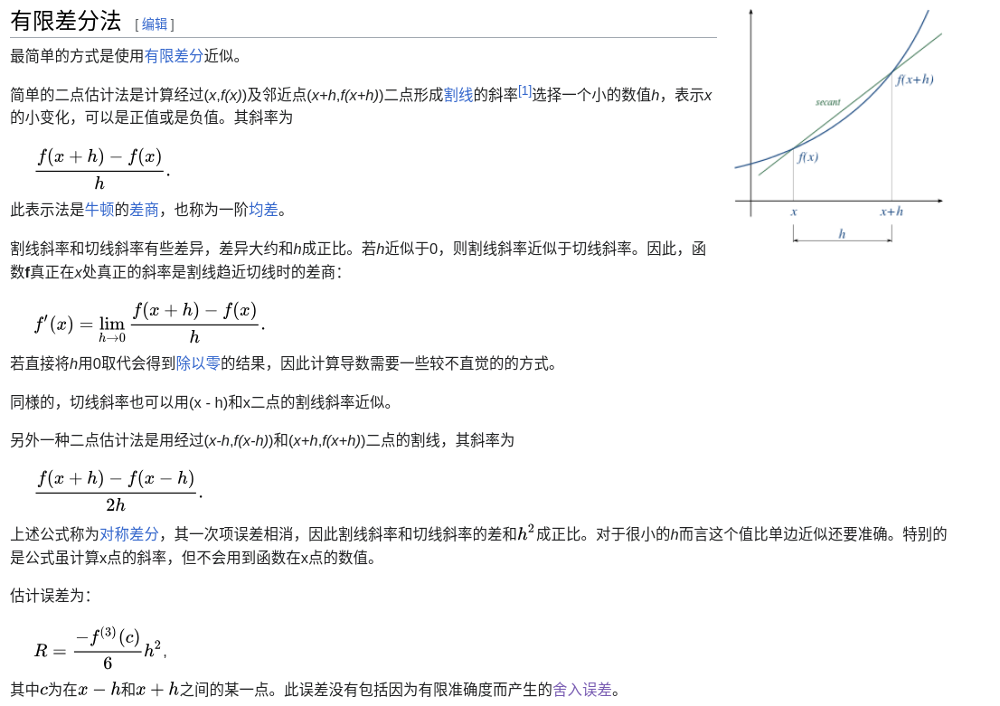
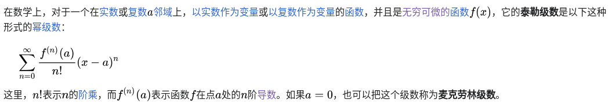
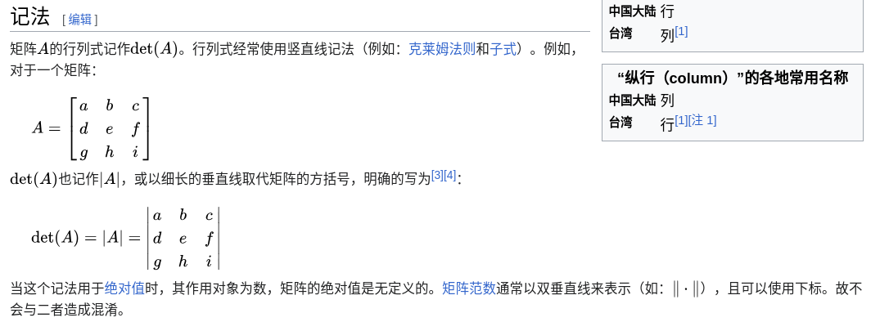
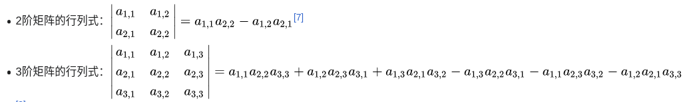
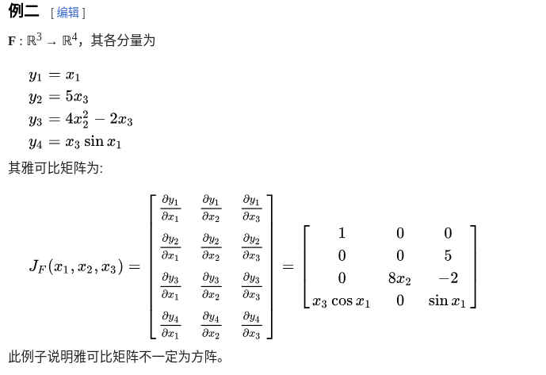
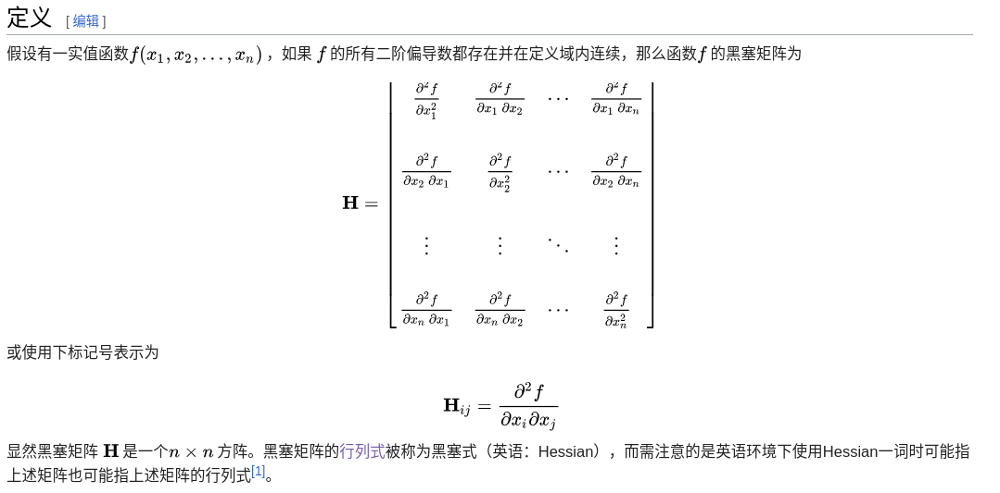

# 数学基础

- [微积分](#微积分)
  - [数值微分](#数值微分)
  - [导数](#导数)
  - [偏导数](#偏导数)
  - [泰勒公式](#泰勒公式)
  - [泰勒级数](#泰勒级数)
- [线性代数](#线性代数)
  - [行列式](#行列式)
  - [正定矩阵](#正定矩阵)
  - [雅克比矩阵](#雅克比矩阵)
  - [黑塞矩阵](#黑塞矩阵)

---

## 微积分

### 数值微分

[ReadMe](./files/数值微分%20-%20维基百科，自由的百科全书.pdf)

> 数值微分是数值方法中的名词，是用函数的值及其他已知资讯来**估计一函数导数的算法**。

### 导数

[ReadMe](./files/导数%20-%20维基百科，自由的百科全书.pdf)

### 偏导数

[ReadMe](./files/偏导数%20-%20维基百科，自由的百科全书.pdf)

### 泰勒公式
[ReadMe](./files/泰勒公式%20-%20维基百科，自由的百科全书.pdf)

> 在数学中，泰勒公式（英语：Taylor's Formula）是一个**用函数在某点的信息描述其附近取值的公式**。

### 泰勒级数
[ReadMe](./files/泰勒级数%20-%20维基百科，自由的百科全书.pdf)

## 线性代数

### [行列式](https://zh.wikipedia.org/wiki/%E8%A1%8C%E5%88%97%E5%BC%8F)

### 正定矩阵

[wiki](https://zh.wikipedia.org/wiki/%E6%AD%A3%E5%AE%9A%E7%9F%A9%E9%98%B5)

[矩阵正定性判定](https://blog.csdn.net/qq_38048756/article/details/115108733)

### 雅克比矩阵

[ReadMe](./files/雅可比矩阵%20-%20维基百科，自由的百科全书.pdf)

> 在向量分析中，雅可比矩阵（也称作Jacobi矩阵，英语：Jacobian matrix）是函数的一阶偏导数以一定方式排列成的矩阵。

### 黑塞矩阵

[ReadMe](./files/黑塞矩阵%20-%20维基百科，自由的百科全书.pdf)

> 黑塞矩阵（德语：Hesse-Matrix；英语：Hessian matrix 或 Hessian），又译作海森矩阵、海塞（赛）矩阵或海瑟矩阵等，是一个由多变量实值函数的所有二阶偏导数组成的方阵，由德国数学家奥托·黑塞引入并以其命名。

