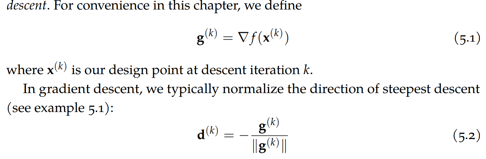
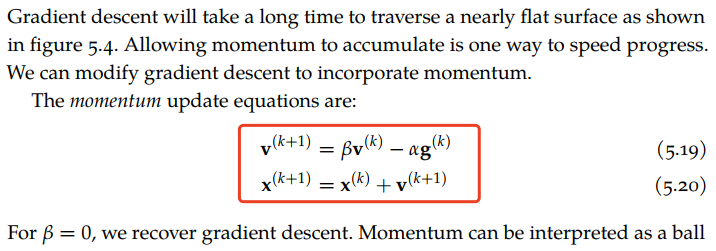
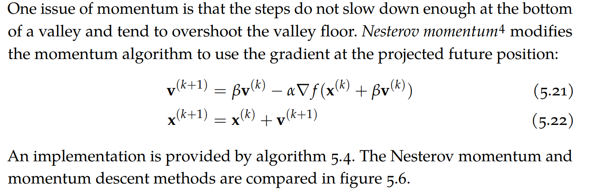
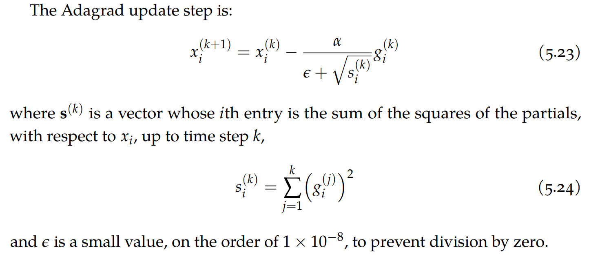
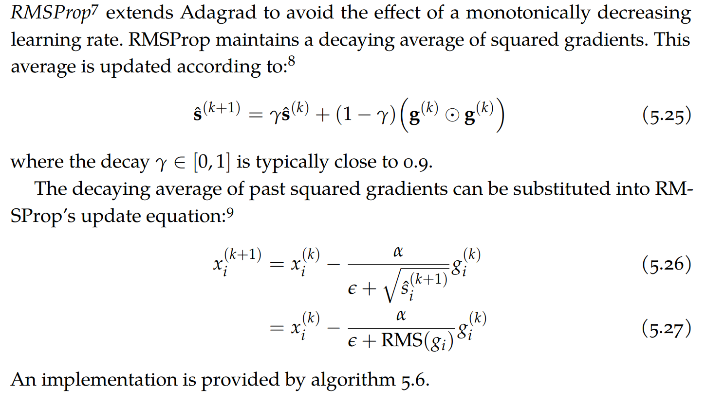
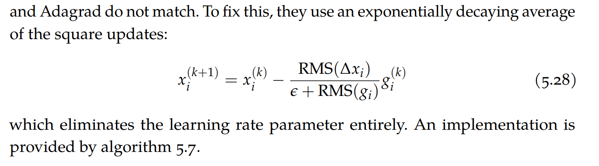
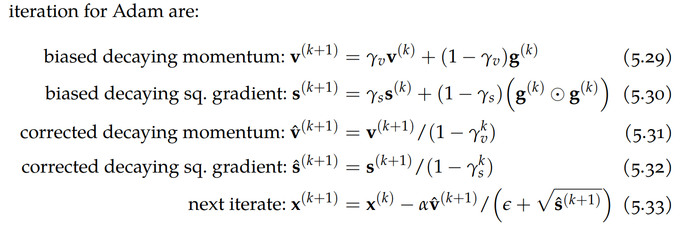

# Gradient Descent (First-Order Methods)

---

- [梯度下降法 wiki](#梯度下降法-wiki)
- [共轭梯度法](#共轭梯度法)
- [Momentum](#momentum)
- [Nesterov Momentum](#nesterov-momentum)
- [Adagrad](#adagrad)
- [RMSProp](#rmsprop)
- [Adadelta](#adadelta)
- [Adam](#adam)
- [参考](#参考)

---

## 梯度下降法 [wiki](https://zh.wikipedia.org/wiki/%E6%A2%AF%E5%BA%A6%E4%B8%8B%E9%99%8D%E6%B3%95)

梯度下降法（英语：Gradient descent）是一个一阶最优化算法，通常也称为最陡下降法，但是不该与近似积分的最陡下降法（英语：Method of steepest descent）混淆。 要使用梯度下降法找到一个函数的局部极小值，必须向函数上当前点对应梯度（或者是近似梯度）的反方向的规定步长距离点进行迭代搜索。如果相反地向梯度正方向迭代进行搜索，则会接近函数的局部极大值点；这个过程则被称为梯度上升法。

> [多元函数求最小值 - 偏导数与梯度下降法&Python法代码示例](https://blog.51cto.com/u_11299290/3651253)

> [example_code](./code/梯度下降/Rosenbrock_gd.ipynb)

## 共轭梯度法

共轭梯度法（Conjugate Gradient）是介于最速下降法与牛顿法之间的一个方法，它仅需利用一阶导数信息，但克服了最速下降法收敛慢的缺点，又避免了牛顿法需要存储和计算Hesse矩阵并求逆的缺点，共轭梯度法不仅是解决大型线性方程组最有用的方法之一，也是解大型非线性最优化最有效的算法之一.

## Momentum

## Nesterov Momentum

## Adagrad

## RMSProp

## Adadelta

## Adam

## 参考

- [从 SGD 到 Adam —— 深度学习优化算法概览(一)](https://zhuanlan.zhihu.com/p/32626442)