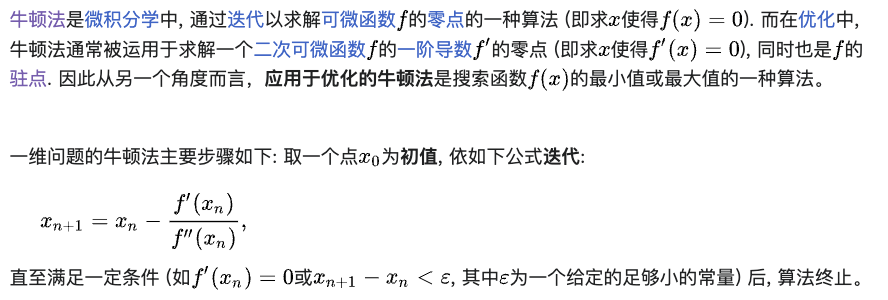
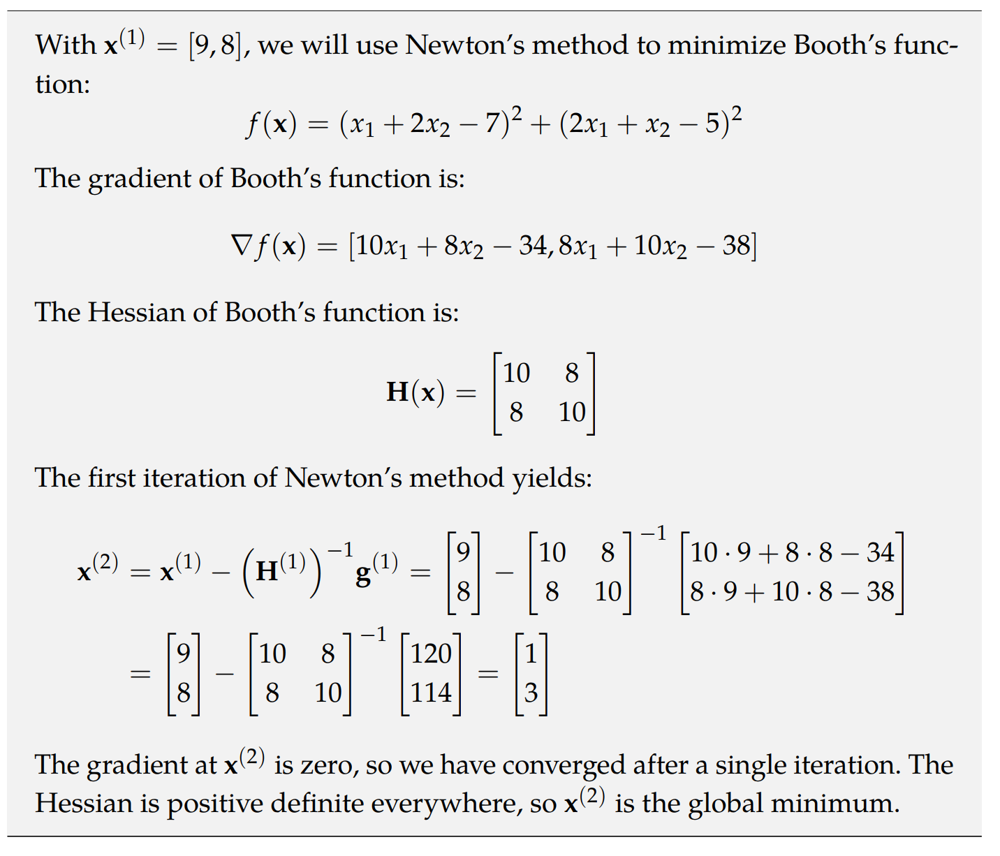

# 牛顿法系列 (Second-Order Methods)

> [维基百科-牛顿法](https://zh.wikipedia.org/wiki/%E7%89%9B%E9%A1%BF%E6%B3%95)
> 
---

## 牛顿法 Newton’s Method
[维基百科](./files/应用于最优化的牛顿法%20-%20维基百科，自由的百科全书.pdf)

## 拟牛顿法 Quasi-Newton Methods
[维基百科](./files/拟牛顿法%20-%20维基百科，自由的百科全书.pdf)

拟牛顿法是一种以牛顿法为基础设计的，求解非线性方程组或连续的最优化问题函数的零点或极大、极小值的算法。当牛顿法中所要求计算的雅可比矩阵或Hessian矩阵难以甚至无法计算时，拟牛顿法便可派上用场。