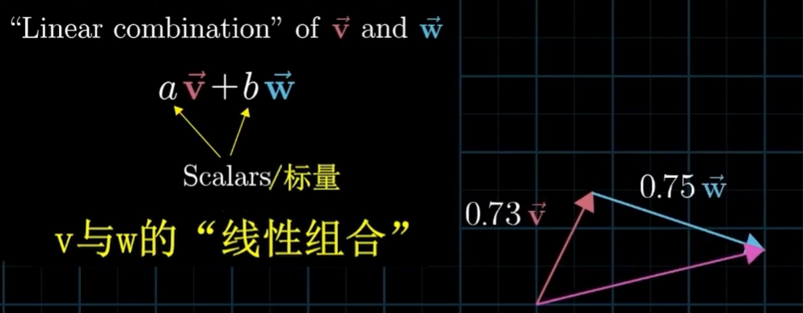
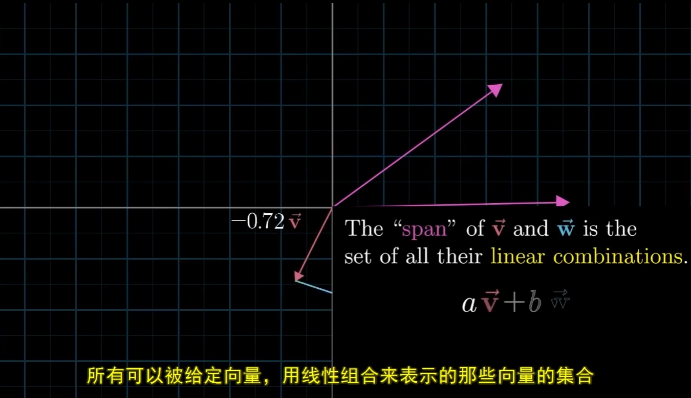
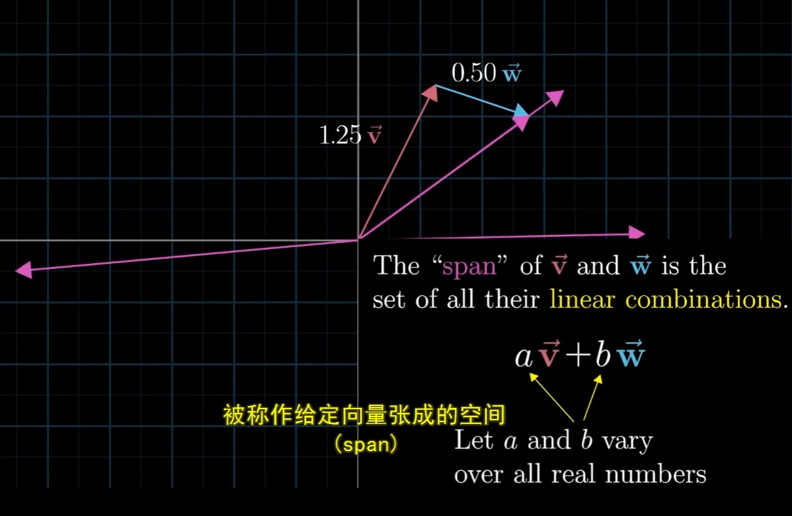
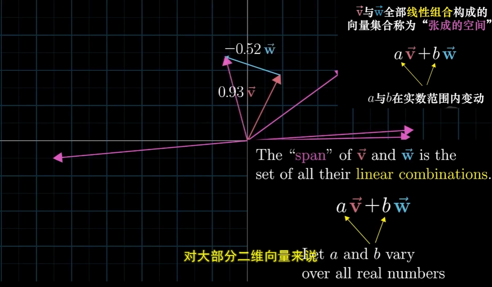
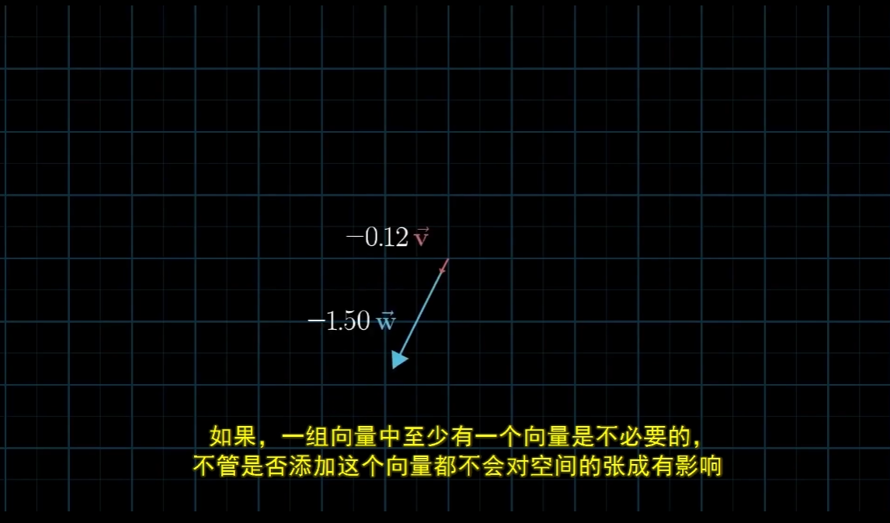
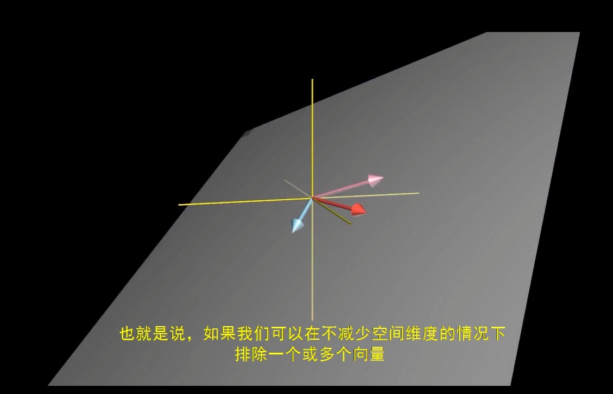
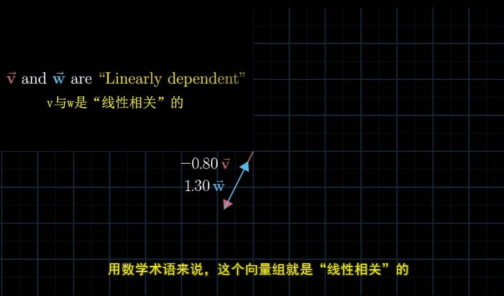
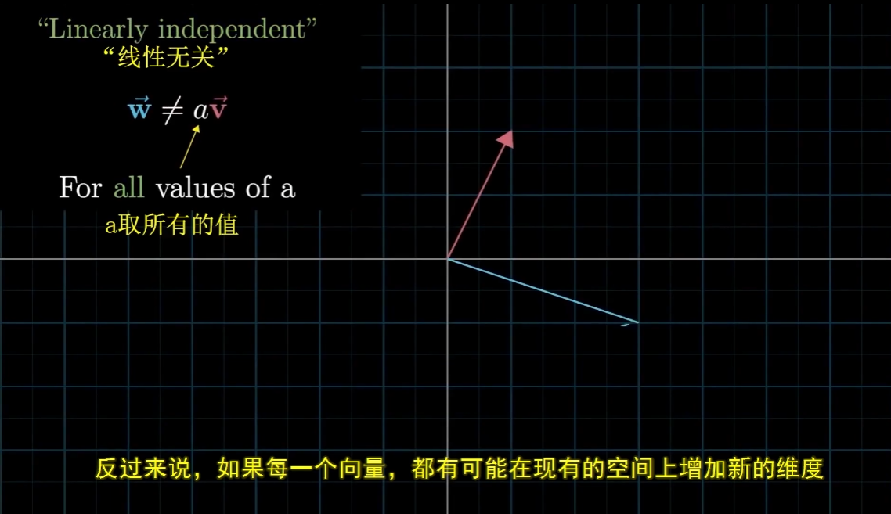
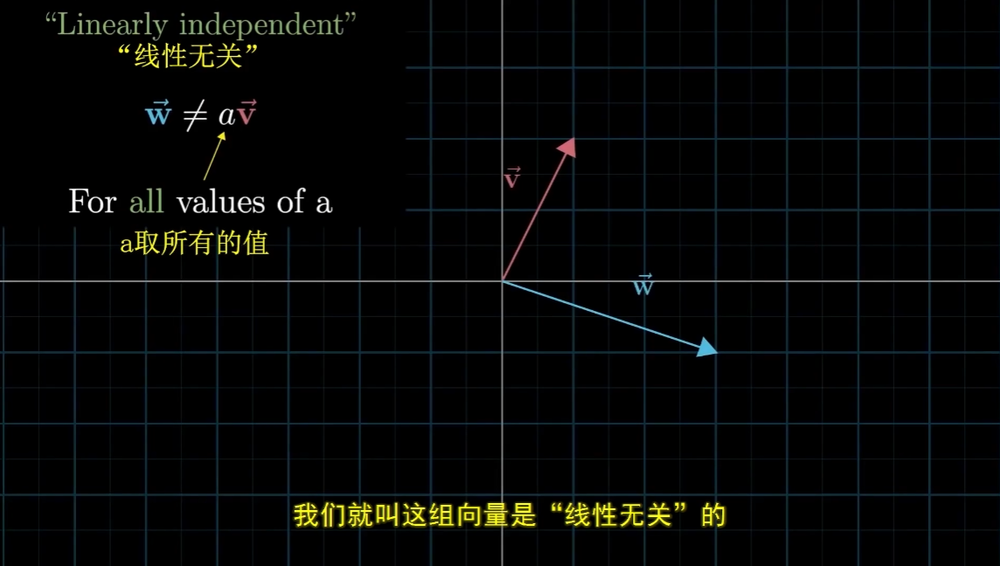
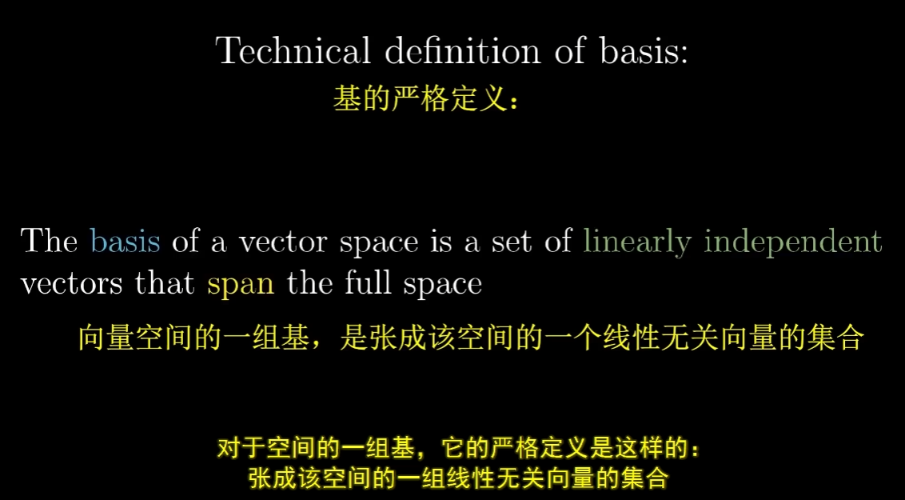

<!--
 * @Date: 2023-03-23 20:03:01
 * @LastEditors: Charles HAO 40482227+hcheng1005@users.noreply.github.com
 * @LastEditTime: 2023-03-23 14:31:07
 * @FilePath: \all-in-one\数学\线性代数\3Blue1Brown\00向量的线性组合.md
-->
# [线性代数的本质--向量的线性组合](https://www.bilibili.com/video/BV1fR4y1E7Pw/?p=3&spm_id_from=pageDriver&vd_source=37fd51fe413044b29e9009b94bd078eb)

- [向量的线性组合](#向量的线性组合)
  - [span](#span)
  - [三维空间的span](#三维空间的span)
  - [什么是线性相关](#什么是线性相关)
  - [基的严格定义](#基的严格定义)

## 向量的线性组合

> 以二维向量举例，其所有的线性组合有两种情况
> 
> 其一：构成平面所有的点
> 
> 其二：初始向量在同一方向的话，其所有线性组合最终只是一条线

### span 

### 三维空间的span
- 两个三维向量的span，可以是线（点），也可以是面；

- 三个三维向量的span，可以是线（点），可以是面。也可以是整个三维空间

### 什么是线性相关

### 基的严格定义

