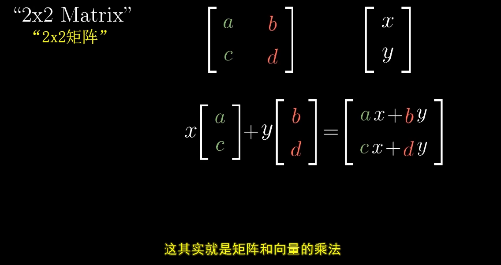

<!--
 * @Date: 2023-03-23 20:03:01
 * @LastEditors: Charles HAO 40482227+hcheng1005@users.noreply.github.com
 * @LastEditTime: 2023-03-23 14:31:27
 * @FilePath: \all-in-one\数学\线性代数\3Blue1Brown\01线性变换.md
-->
# [线性代数的本质-矩阵与线性相关](https://www.bilibili.com/video/BV1fR4y1E7Pw/?p=4&spm_id_from=pageDriver&vd_source=37fd51fe413044b29e9009b94bd078eb)

- [线性变换](#线性变换)
  - [线性变换的定义](#线性变换的定义)
  - [直观演示](#直观演示)
  - [变换后的坐标公式](#变换后的坐标公式)
- [小结](#小结)
- [任意向量的变换](#任意向量的变换)
- [矩阵乘法](#矩阵乘法)
- [变换后降维](#变换后降维)

## 线性变换
> **"变换"更强调空间中的动作，比如拉伸、压缩、旋转。**

> 把”变换“看做是一种运动。

### 线性变换的定义

### 直观演示

> 

> 

> 

> 

> 

> 

> 

> 

> 

> 

### 变换后的坐标公式

## 小结

>

>

## 任意向量的变换

## 矩阵乘法

 

## 变换后降维
> **变换后的基向量线性相关。**

 