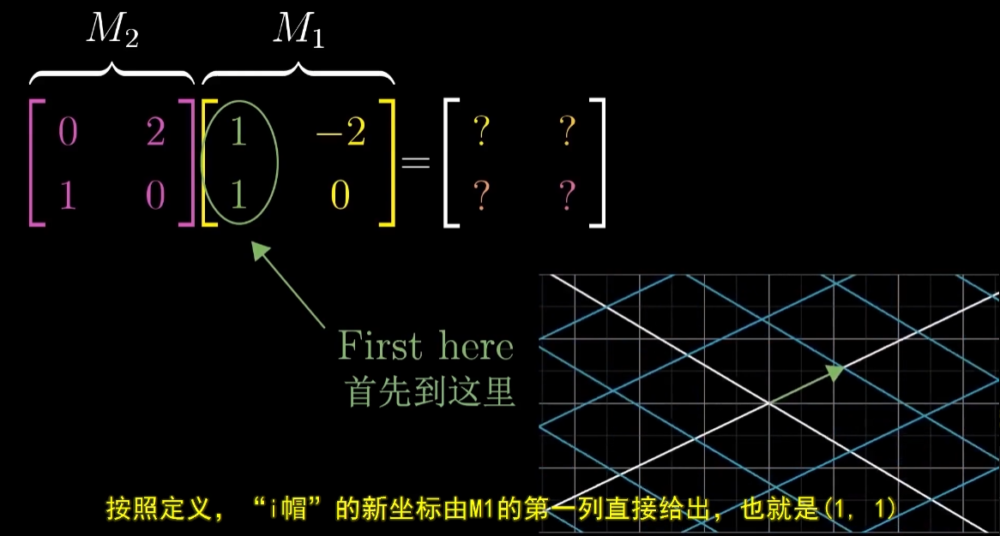

<!--
 * @Date: 2023-03-23 14:27:53
 * @LastEditors: Charles HAO 40482227+hcheng1005@users.noreply.github.com
 * @LastEditTime: 2023-03-23 15:04:48
 * @FilePath: \all-in-one\数学\线性代数\3Blue1Brown\02矩阵乘法.md
-->
# [线性代数的本质--矩阵乘法与线性变换复合](https://www.bilibili.com/video/BV1fR4y1E7Pw/?p=5&spm_id_from=pageDriver&vd_source=37fd51fe413044b29e9009b94bd078eb)

- [复合变换](#复合变换)
  - [两次变换：先旋转-再剪切](#两次变换先旋转-再剪切)
  - [小结](#小结)
  - [变换顺序](#变换顺序)
- [矩阵乘积](#矩阵乘积)
  - [矩阵乘法通式表达](#矩阵乘法通式表达)
- [一些性质](#一些性质)

## 复合变换
> **进行多次线性变换。**

### 两次变换：先旋转-再剪切

>

### 小结

### 变换顺序

## 矩阵乘积 

### 矩阵乘法通式表达

## 一些性质
> AB≠BA（不满足交换律）
> 
> (AB)C=A(BC) (满足结合律)