<!--
 * @Date: 2023-03-25 11:53:06
 * @LastEditors: Charles HAO 40482227+hcheng1005@users.noreply.github.com
 * @LastEditTime: 2023-03-25 12:53:41
 * @FilePath: \all-in-one\数学\线性代数\3Blue1Brown\03矩阵行列式.md
-->
# [矩阵行列式](https://www.bilibili.com/video/BV1fR4y1E7Pw?p=7&vd_source=37fd51fe413044b29e9009b94bd078eb)

- [面积拉伸](#面积拉伸)
  - [例子1](#例子1)
  - [例子2](#例子2)
- [行列式的定义](#行列式的定义)
- [行列式=0 -\> 降维](#行列式0---降维)
- [行列式为负数？](#行列式为负数)
  - [理解一](#理解一)
  - [理解二](#理解二)
  - [总结](#总结)
- [行列式的计算](#行列式的计算)
  - [公式的来源](#公式的来源)
- [三阶行列式计算](#三阶行列式计算)
- [扩展](#扩展)

前面提到矩阵相乘可以理解为线性变换，那么，如何描述这种变换带来的区域面积增大或缩小的比例呢？

## 面积拉伸

下面看一个例子：

### 例子1

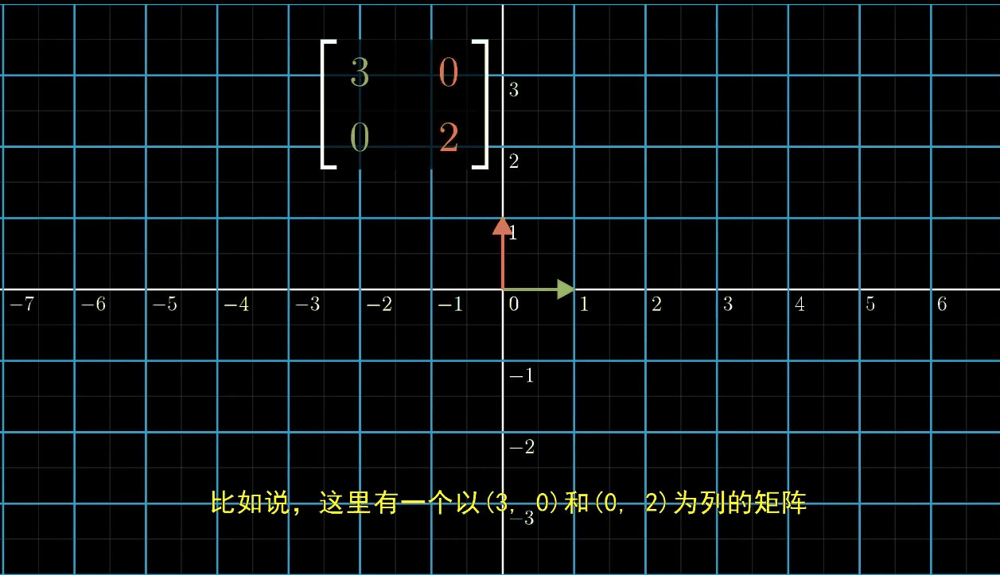

### 例子2

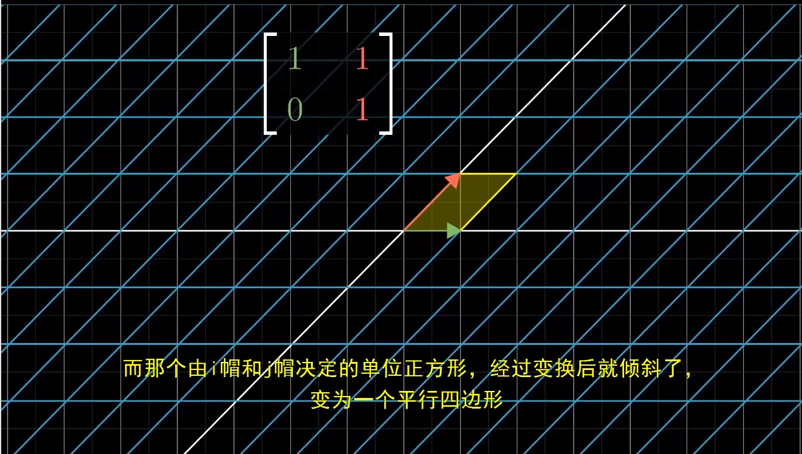

## 行列式的定义
> **行列式的几何意义：线性变换的缩放比例**
> 

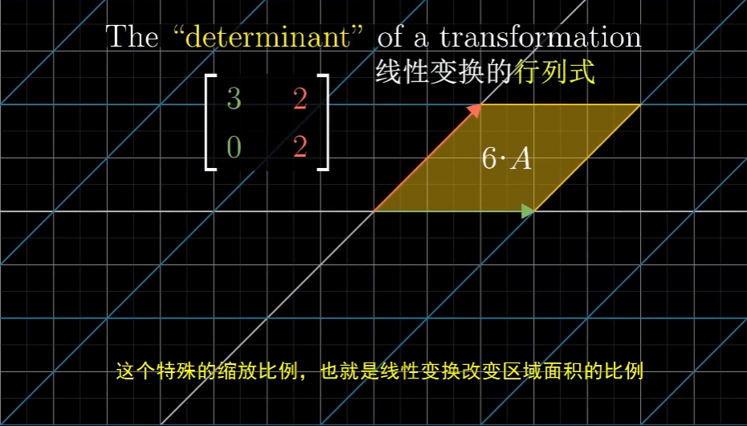

>

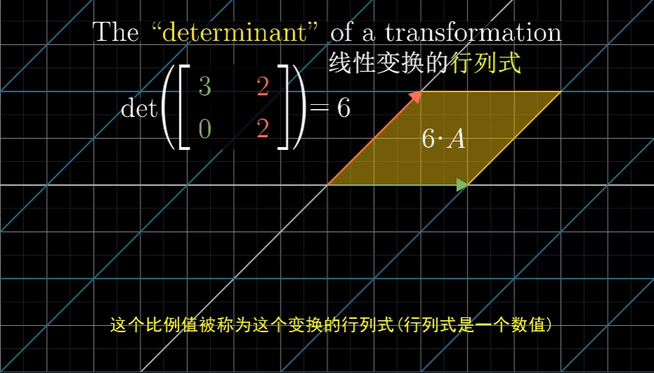

**行列式为0.5**：

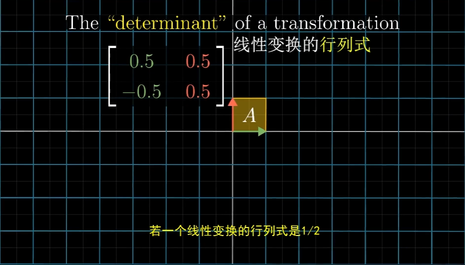

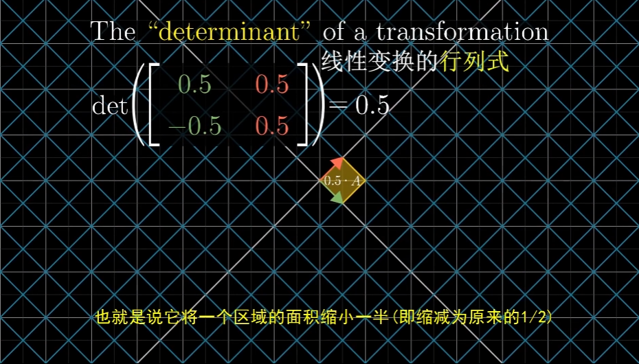

## 行列式=0 -> 降维
> **通过判定行列式是否为0，就能判断出这个矩阵所带边的变换，是否将空间降低到更小的维度上**

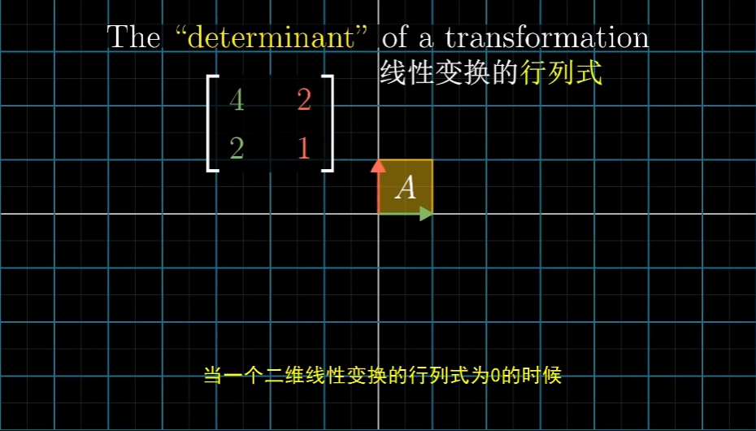

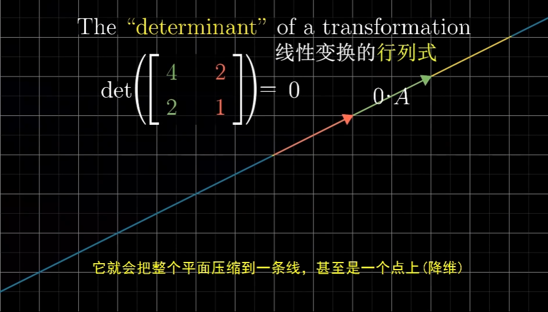

## 行列式为负数？
> **当变换可以改变空间定向时，行列式就是负数。**
>

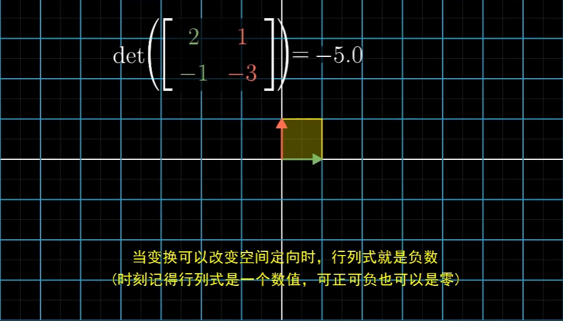

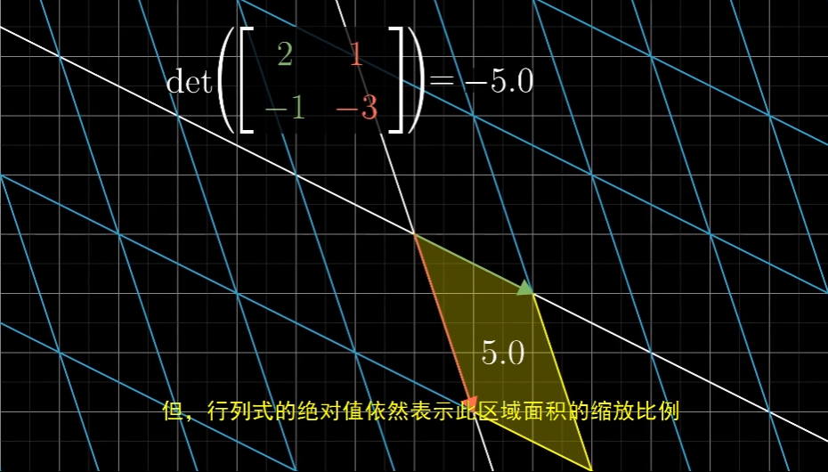

### 理解一

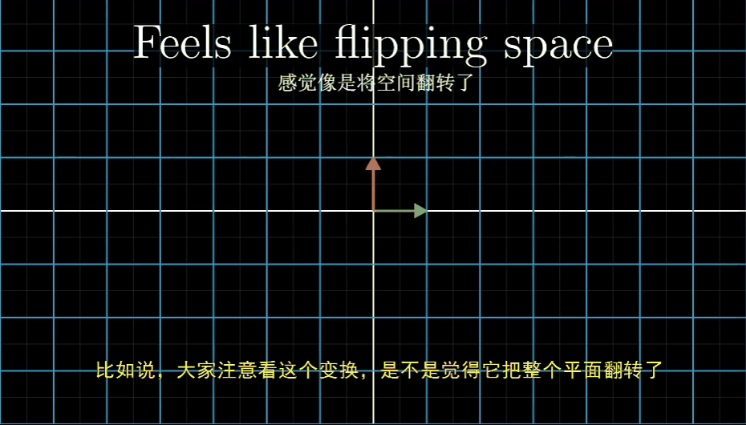

### 理解二

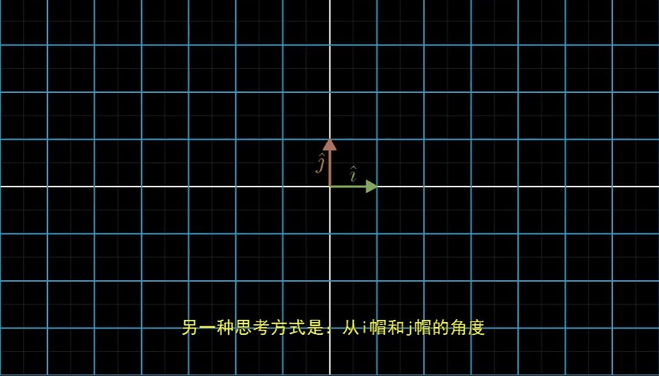

### 总结

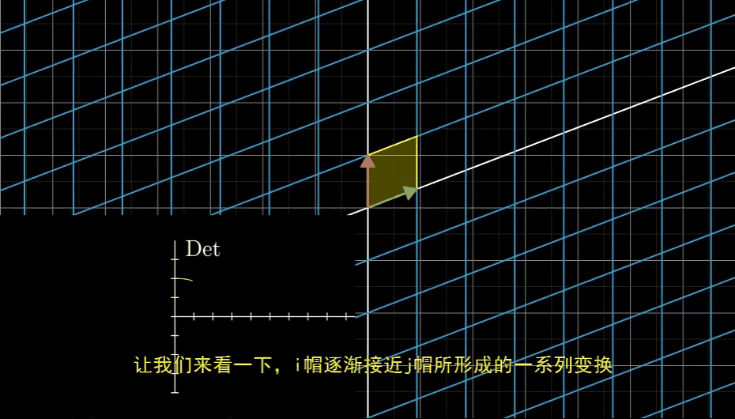

## 行列式的计算

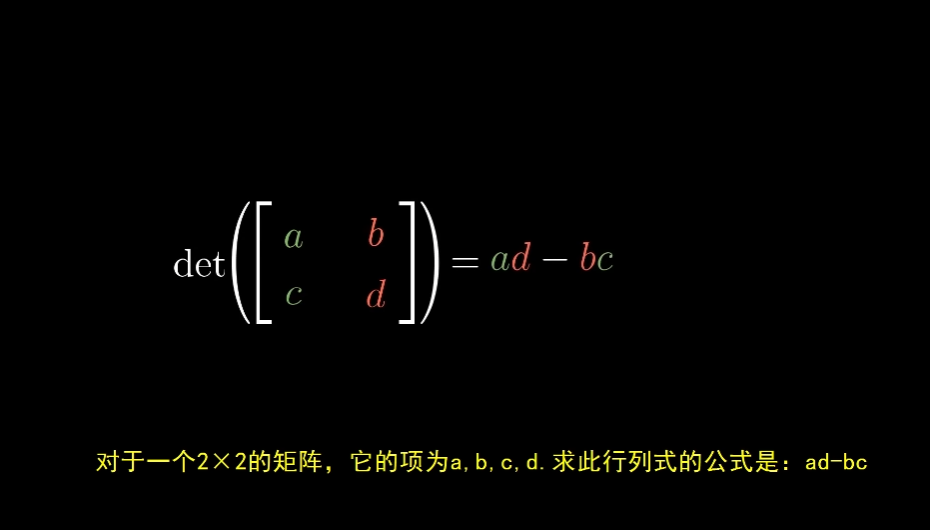

### 公式的来源

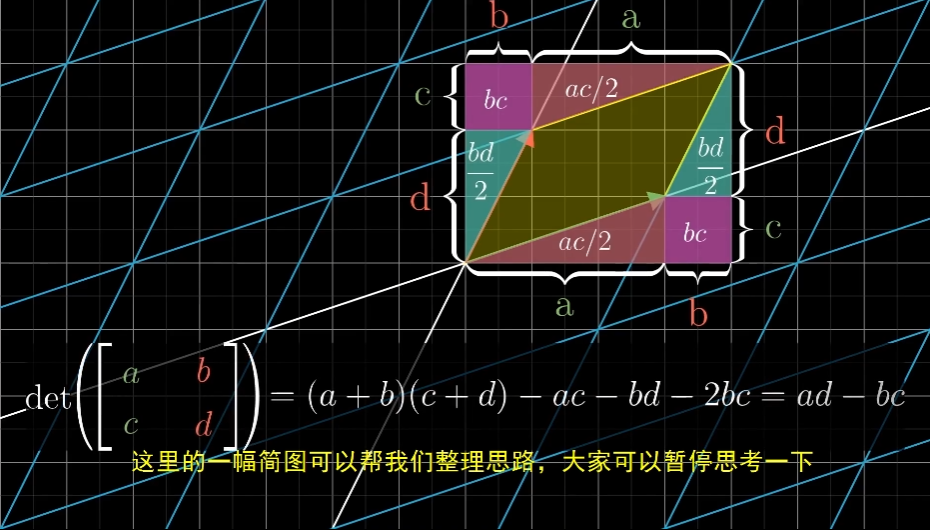

> 

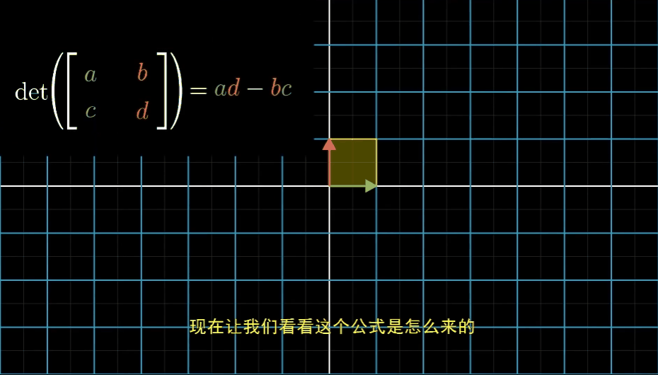

## 三阶行列式计算

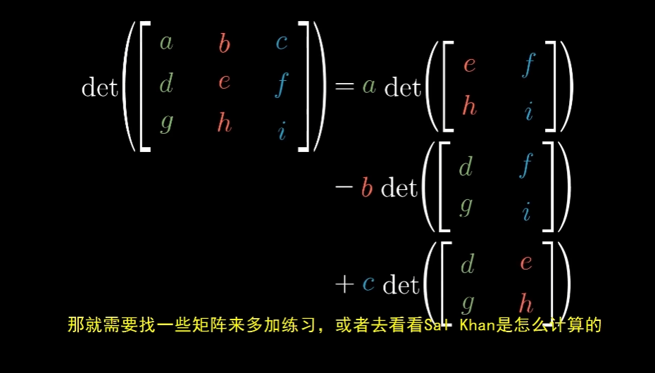

## 扩展
> **两个矩阵相乘后的行列式等于两个矩阵行列式的乘积。**

