<!--
 * @Date: 2023-03-25 15:45:16
 * @LastEditors: Charles HAO 40482227+hcheng1005@users.noreply.github.com
 * @LastEditTime: 2023-03-25 16:30:58
 * @FilePath: \all-in-one\数学\线性代数\3Blue1Brown\05列空间-秩与零空间.md
-->
# [列空间-秩与零空间](https://www.bilibili.com/video/BV1fR4y1E7Pw?p=8&spm_id_from=pageDriver&vd_source=37fd51fe413044b29e9009b94bd078eb)

## 秩Rank

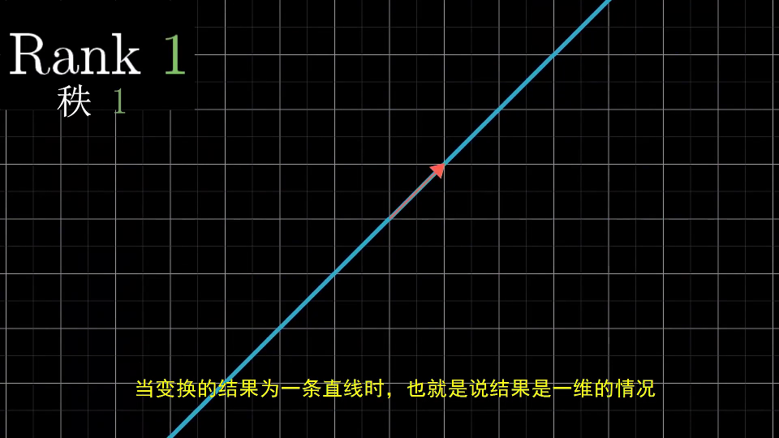

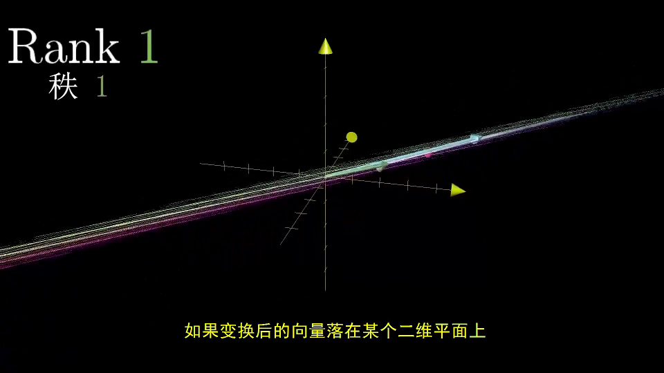

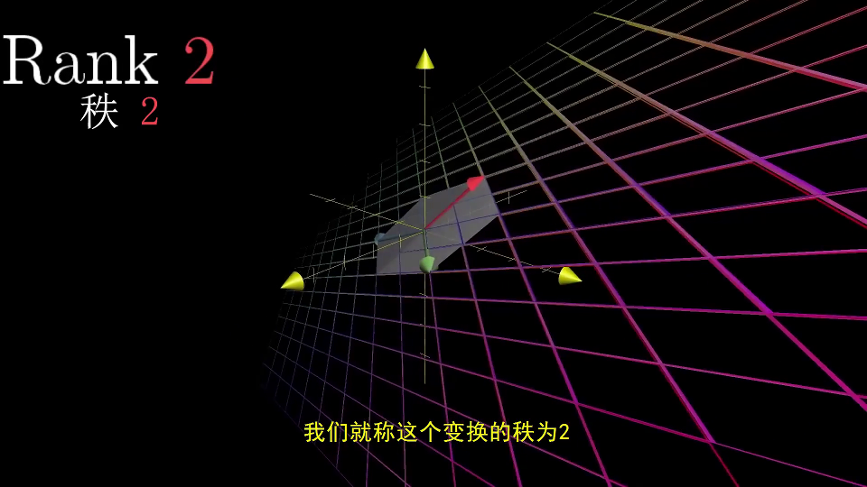

### 秩的定义

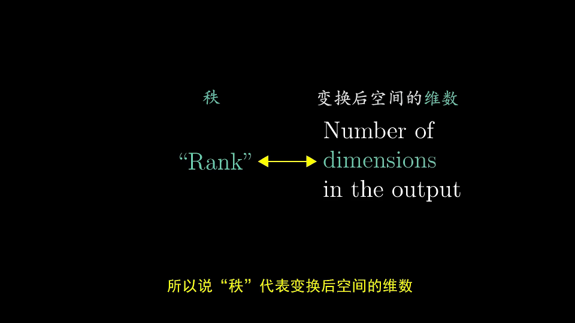

## 列空间

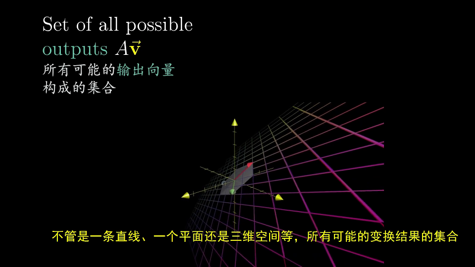

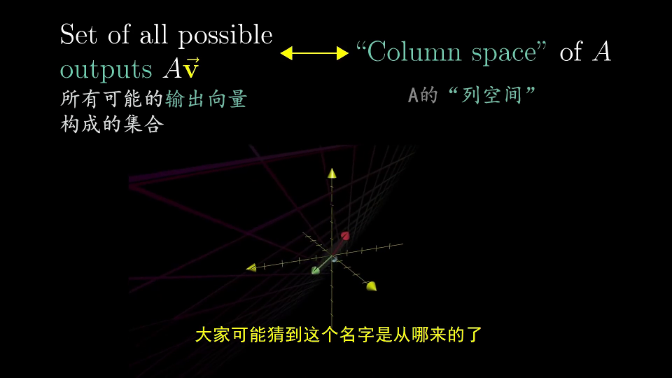

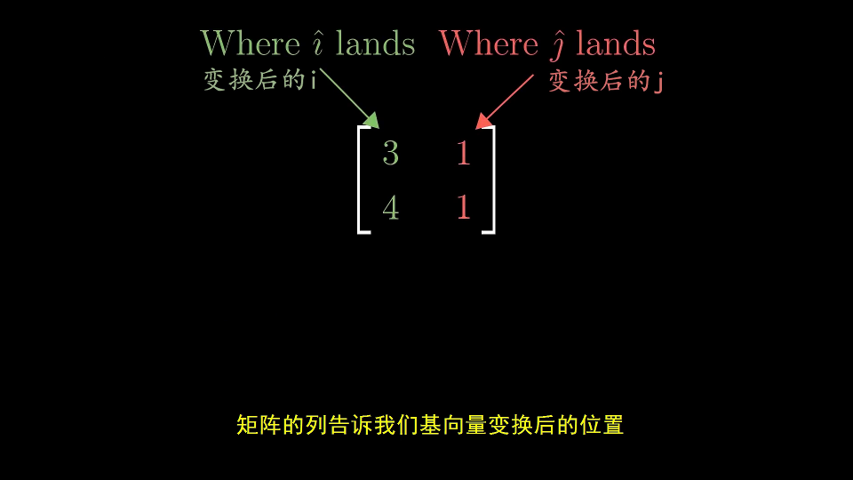

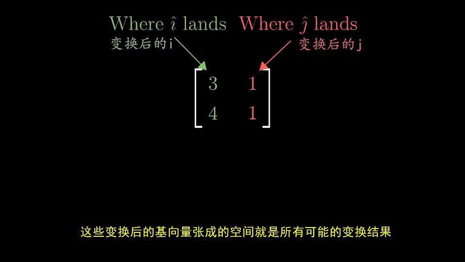

### 满秩

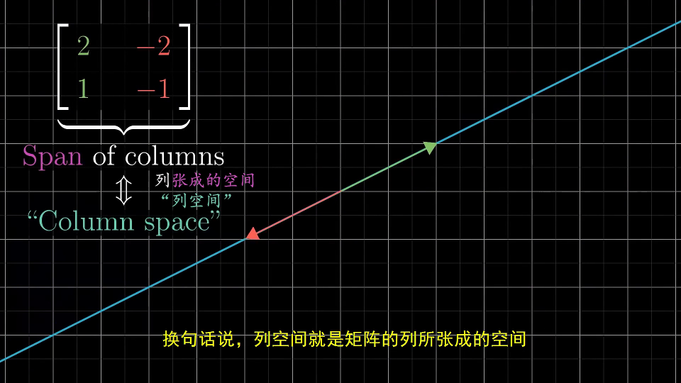

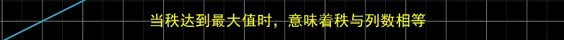

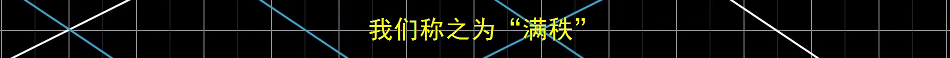

## 零空间、核

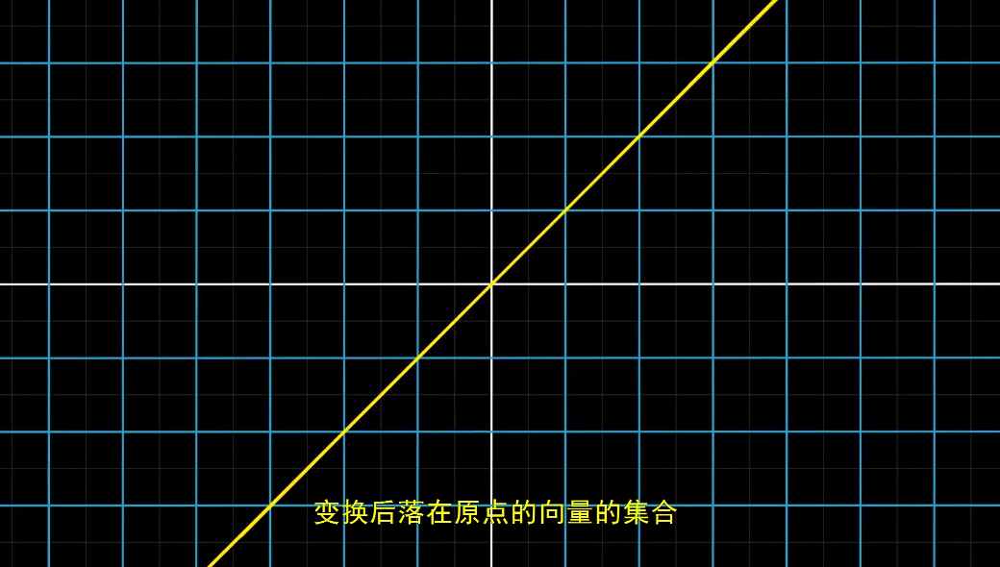

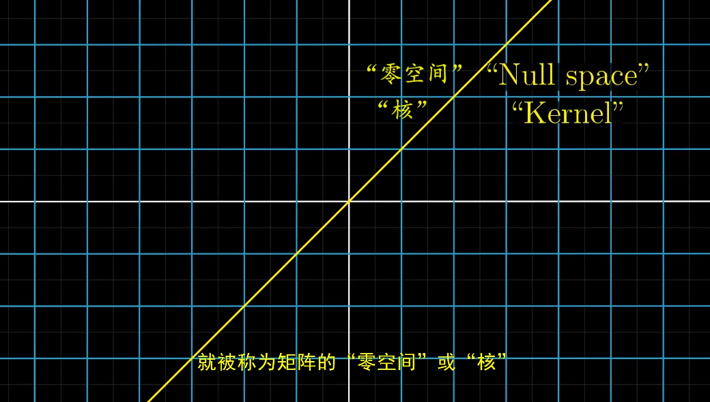

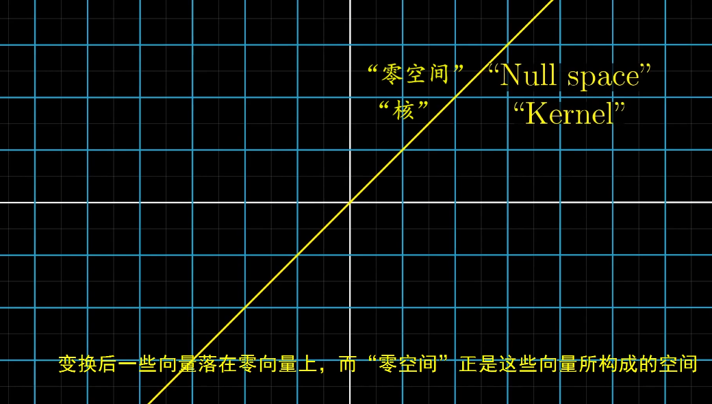

## 总结

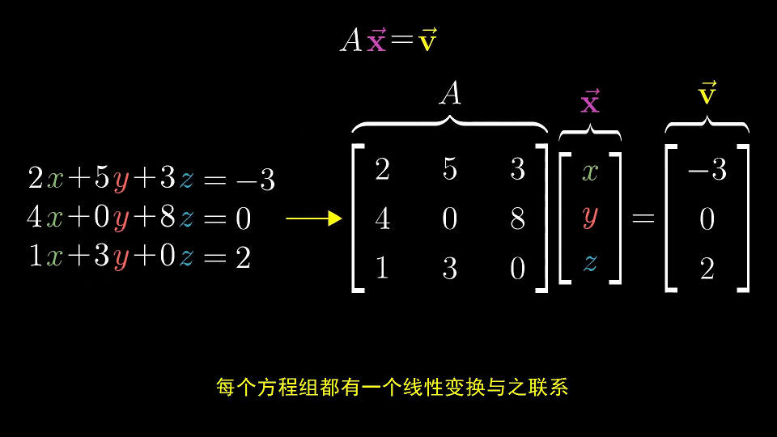

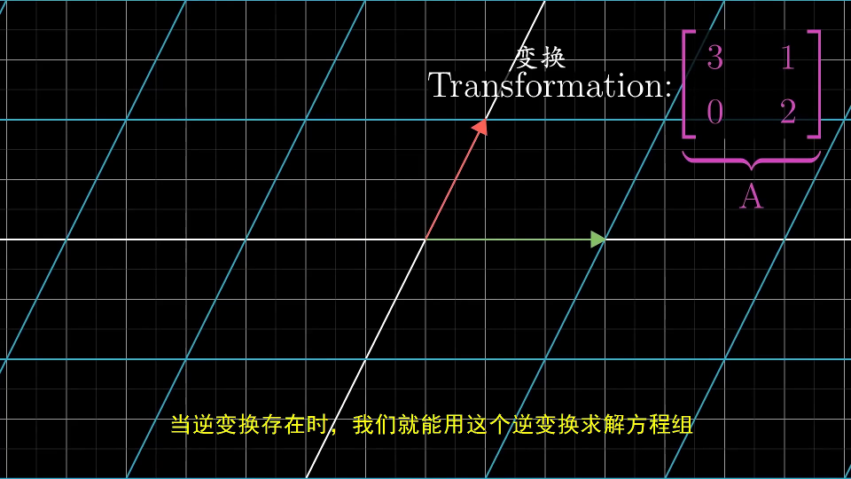

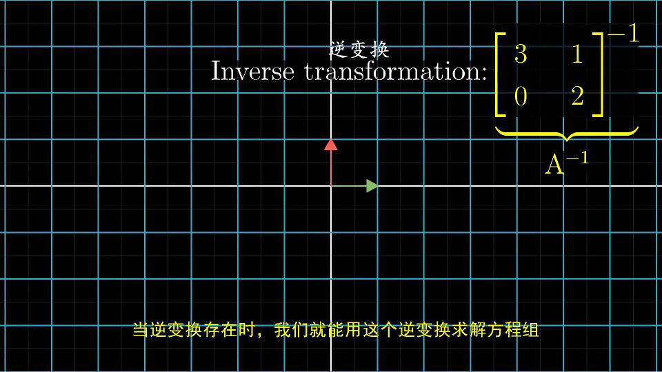

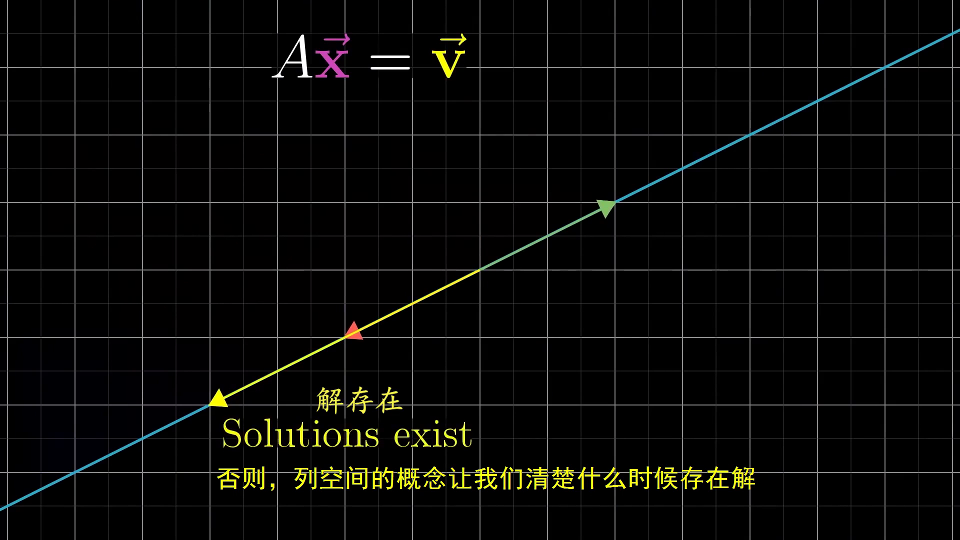

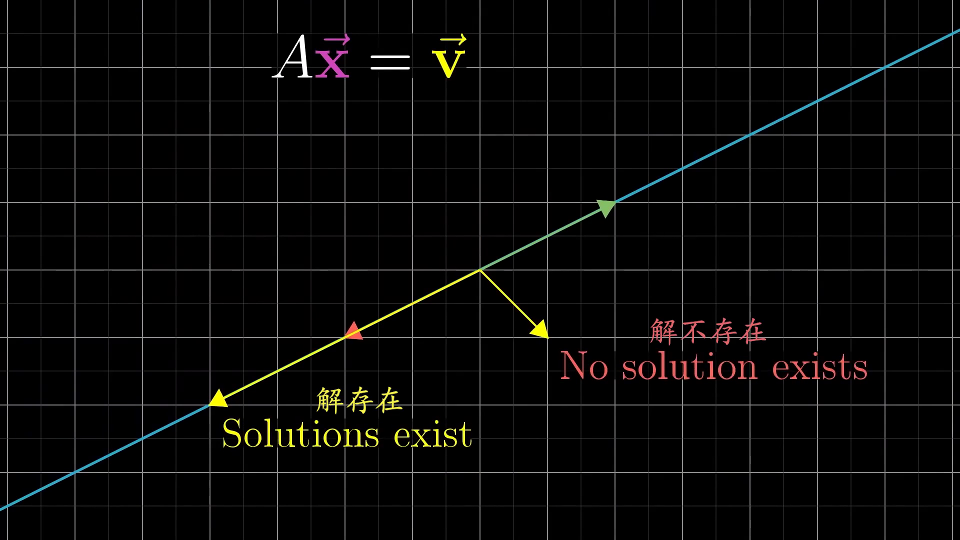

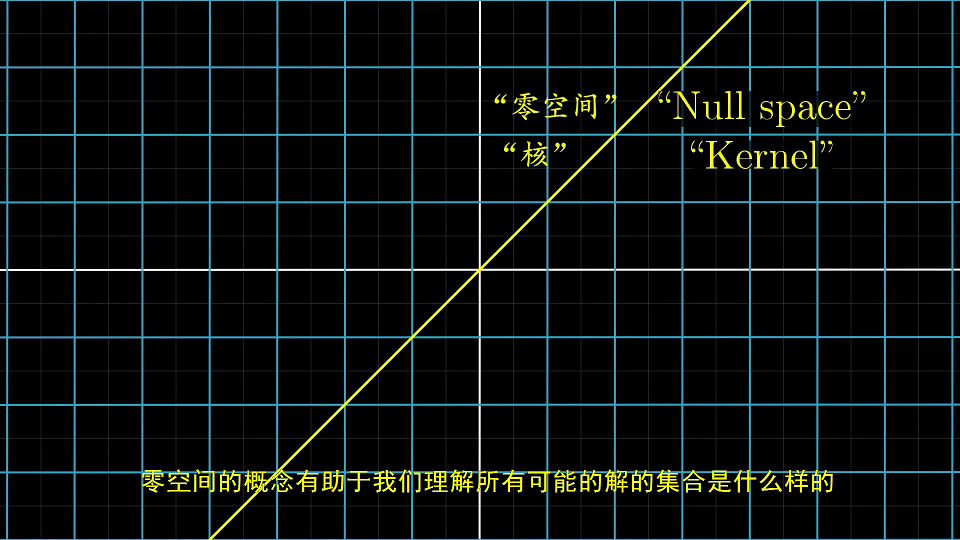

