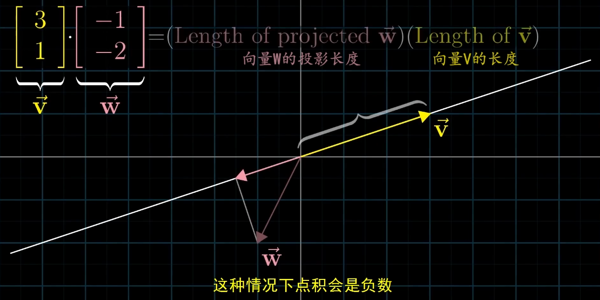

<!--
 * @Date: 2023-03-25 17:14:30
 * @LastEditors: Charles HAO 40482227+hcheng1005@users.noreply.github.com
 * @LastEditTime: 2023-03-25 17:44:05
 * @FilePath: \all-in-one\数学\线性代数\3Blue1Brown\克莱姆法则-点积-叉积.md
-->
# 一些汇总

- [克莱姆法则](#克莱姆法则)
- [点积](#点积)
  - [数学定义](#数学定义)
  - [几何解释](#几何解释)
- [叉积](#叉积)

## [克莱姆法则](https://www.bilibili.com/video/BV1fR4y1E7Pw/?p=9&spm_id_from=pageDriver&vd_source=37fd51fe413044b29e9009b94bd078eb)

## [点积](https://www.bilibili.com/video/BV1fR4y1E7Pw/?p=11&spm_id_from=pageDriver&vd_source=37fd51fe413044b29e9009b94bd078eb)
### 数学定义

### 几何解释

## [叉积](https://www.bilibili.com/video/BV1fR4y1E7Pw?p=12&vd_source=37fd51fe413044b29e9009b94bd078eb)

