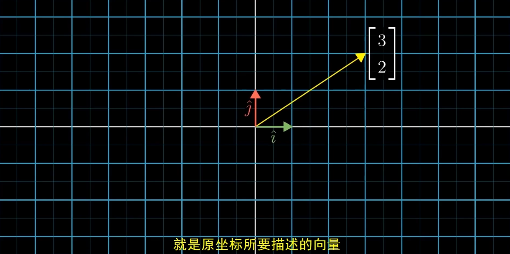
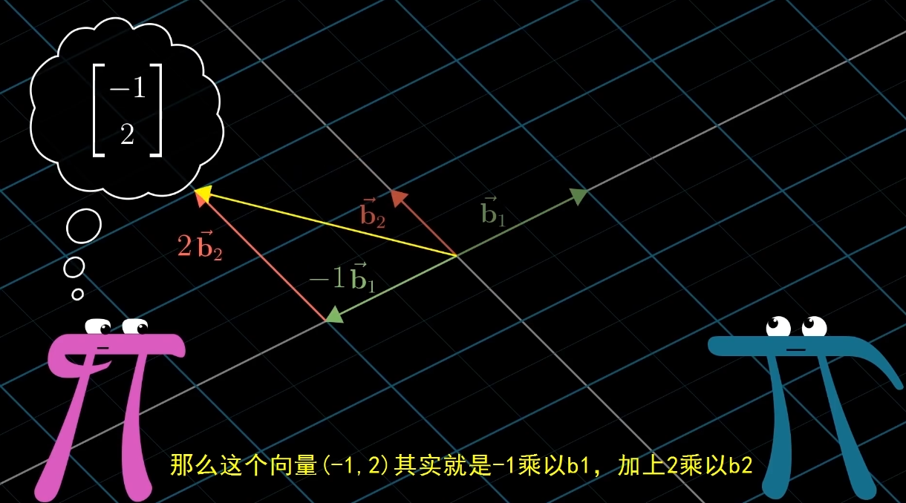

<!--
 * @Date: 2023-03-25 17:51:11
 * @LastEditors: Charles HAO 40482227+hcheng1005@users.noreply.github.com
 * @LastEditTime: 2023-03-25 18:24:53
 * @FilePath: \all-in-one\数学\线性代数\3Blue1Brown\07基向量.md
-->
# [基向量](https://www.bilibili.com/video/BV1fR4y1E7Pw?p=14&spm_id_from=pageDriver&vd_source=37fd51fe413044b29e9009b94bd078eb)

- [背景](#背景)
- [坐标系与基向量](#坐标系与基向量)
- [不同基向量的描述](#不同基向量的描述)
- [坐标系转换](#坐标系转换)

## 背景

## 坐标系与基向量

## 不同基向量的描述

## 坐标系转换

