<!--
 * @Date: 2023-03-25 18:22:53
 * @LastEditors: Charles HAO 40482227+hcheng1005@users.noreply.github.com
 * @LastEditTime: 2023-03-26 14:06:29
 * @FilePath: \all-in-one\数学\线性代数\3Blue1Brown\09特征值和特征向量2.md
-->
# [特征值和特征向量2](https://www.bilibili.com/video/BV1fR4y1E7Pw?p=15&spm_id_from=pageDriver&vd_source=37fd51fe413044b29e9009b94bd078eb)

- [数学定义](#数学定义)
- [求解特征向量和特征值](#求解特征向量和特征值)
  - [等式重写](#等式重写)
  - [矩阵变形](#矩阵变形)
  - [举例](#举例)
  - [总结](#总结)

## 数学定义

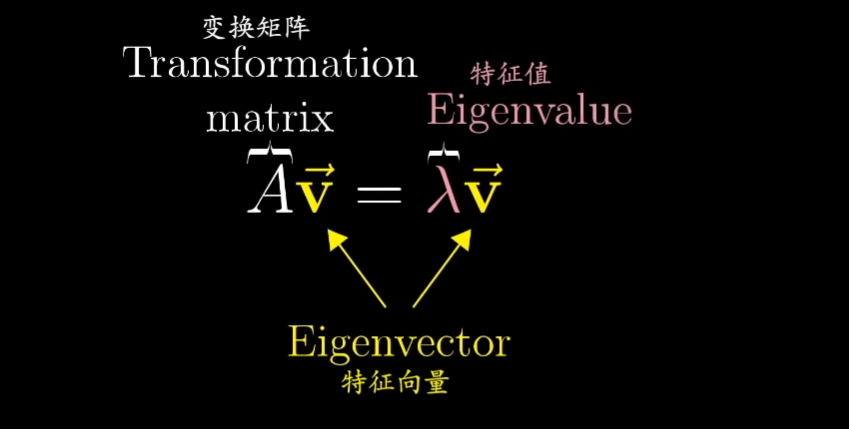

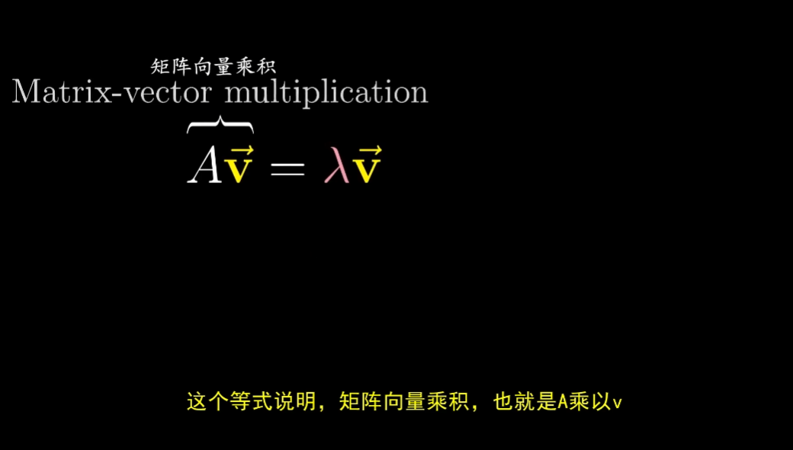

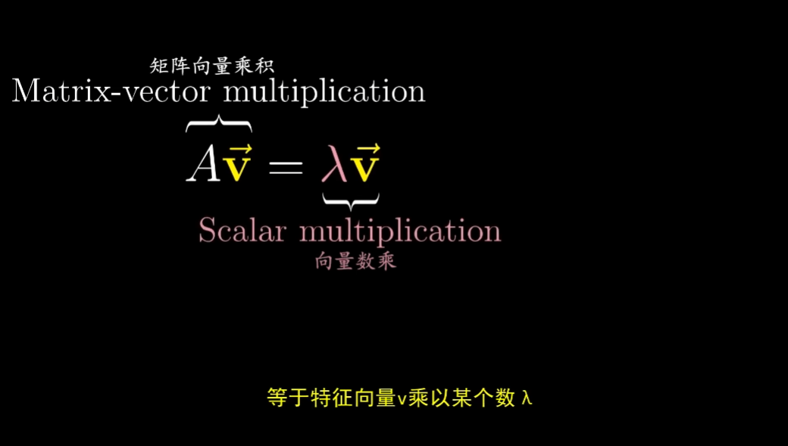

## 求解特征向量和特征值

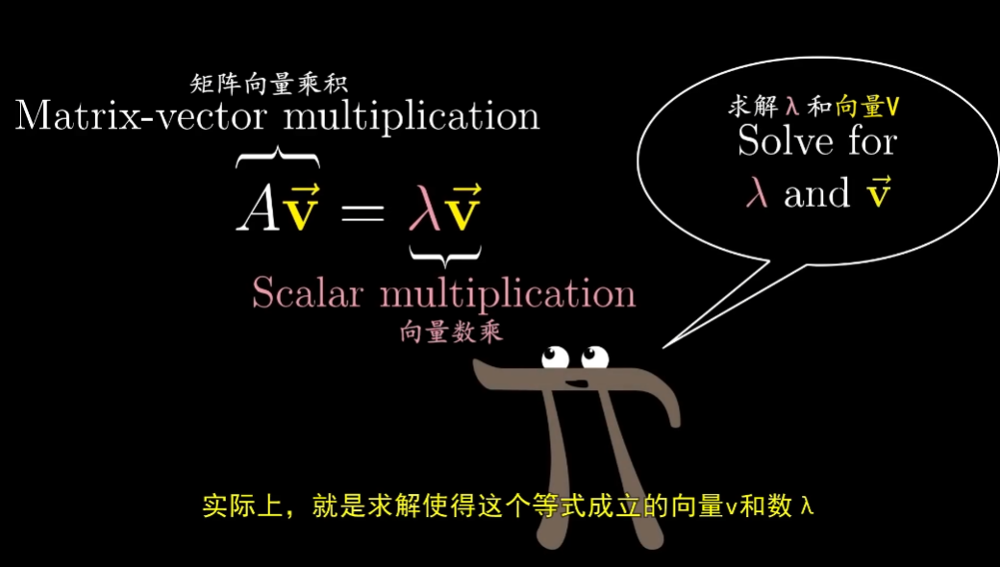

> 等号左侧代表的是矩阵向量乘积，右侧代表的是向量数乘。

### 等式重写

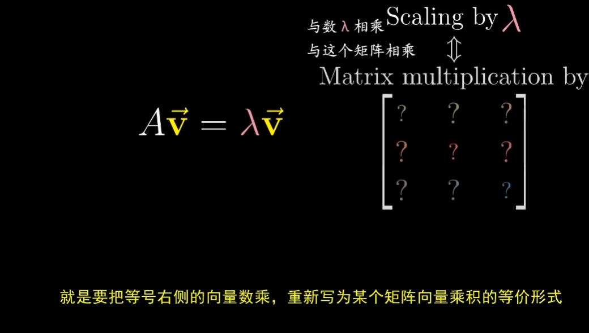

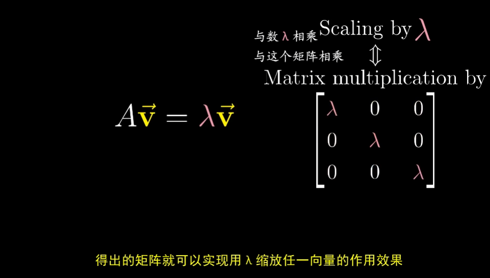

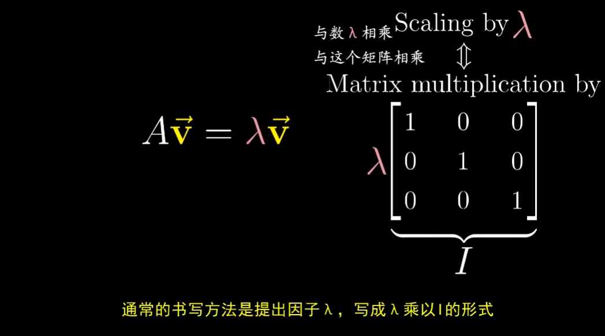

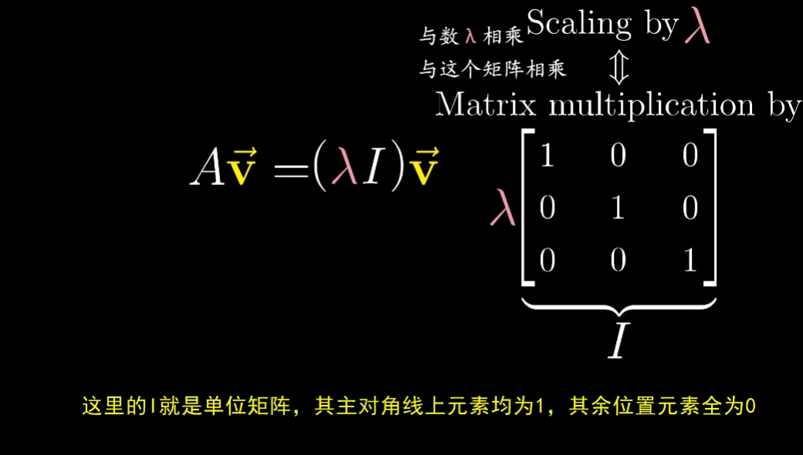

### 矩阵变形

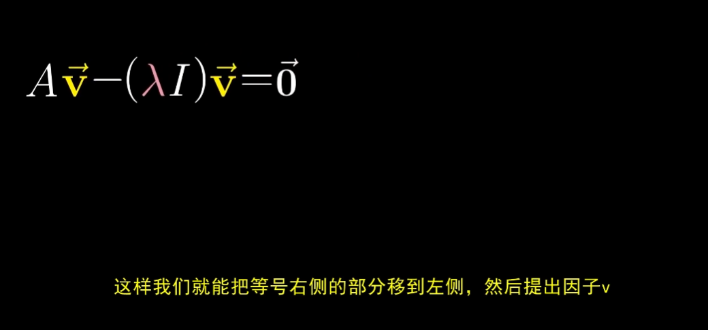

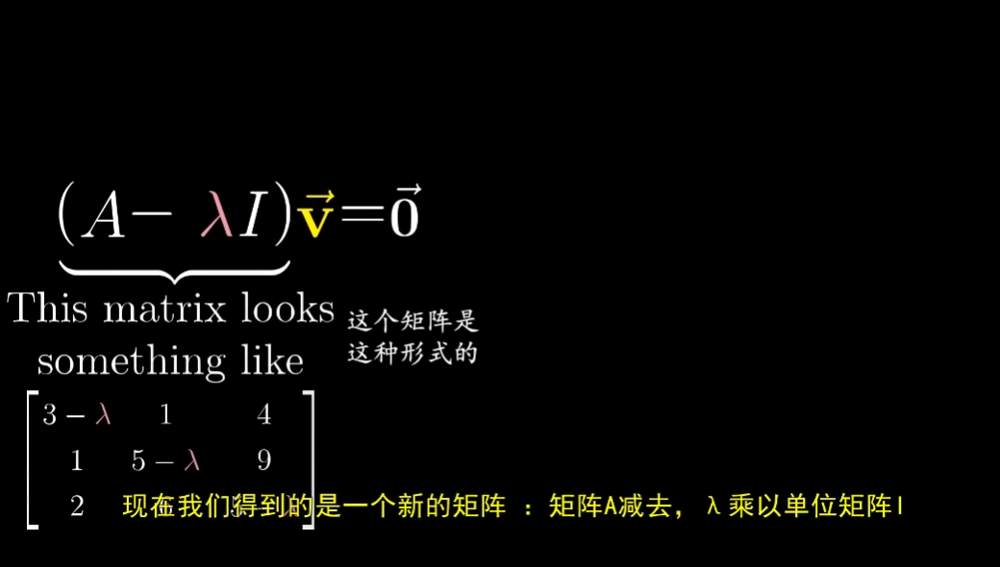

下面就是寻找一个向量V，使得这个新矩阵与v相乘后的结果为零向量（v本身就是零向量这种情况没有意义，这里不考虑此情况）。

通过前面行列式知识，**当且仅当矩阵代表的变换将空间压缩到更低的维度时，才会让一个矩阵和一个非零向量的乘积为零向量。**

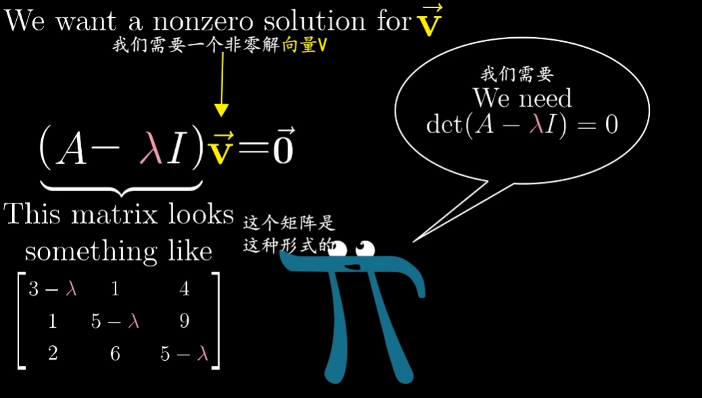

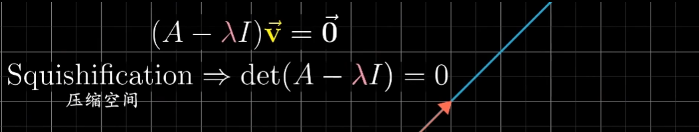

### 举例

### 总结

