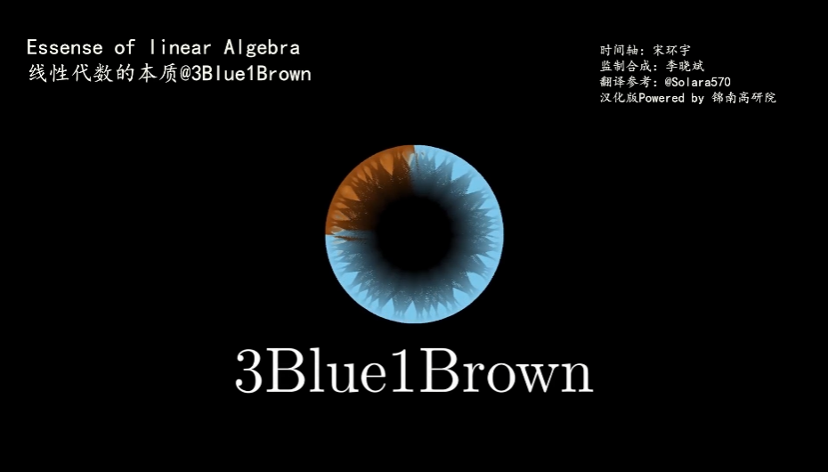

<!--
 * @Date: 2023-03-25 13:06:44
 * @LastEditors: Charles HAO 40482227+hcheng1005@users.noreply.github.com
 * @LastEditTime: 2023-03-26 14:23:58
 * @FilePath: \all-in-one\数学\线性代数\3Blue1Brown\目录.md
-->
# 线性代数的本质

- [00向量的线性组合](00向量的线性组合.md)
- [01线性变换](01线性变换.md)
- [02矩阵乘法](02矩阵乘法.md)
- [03矩阵行列式](03矩阵行列式.md)
- [04逆矩阵](04逆矩阵.md)
- [05列空间-秩与零空间](05列空间-秩与零空间.md)
- [06克莱姆法则-点积-叉积](06克莱姆法则-点积-叉积.md)
- [07基向量](07基向量.md)
- [08特征值和特征向量1](08特征值和特征向量1.md)
- [09特征值和特征向量2](09特征值和特征向量2.md)

