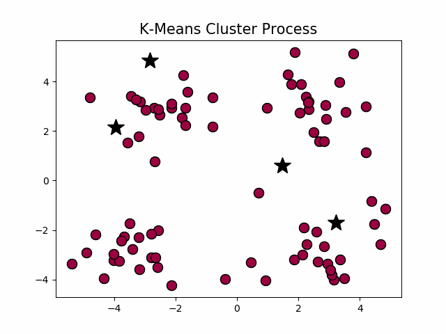
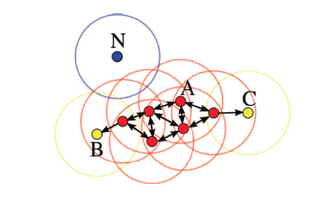
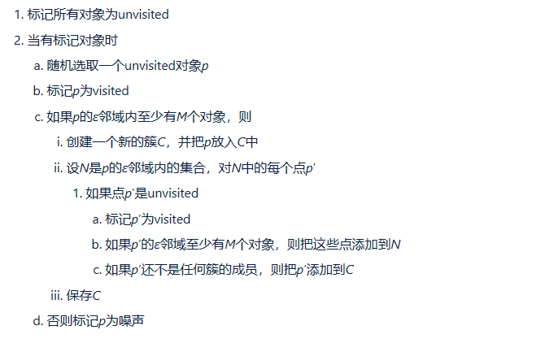
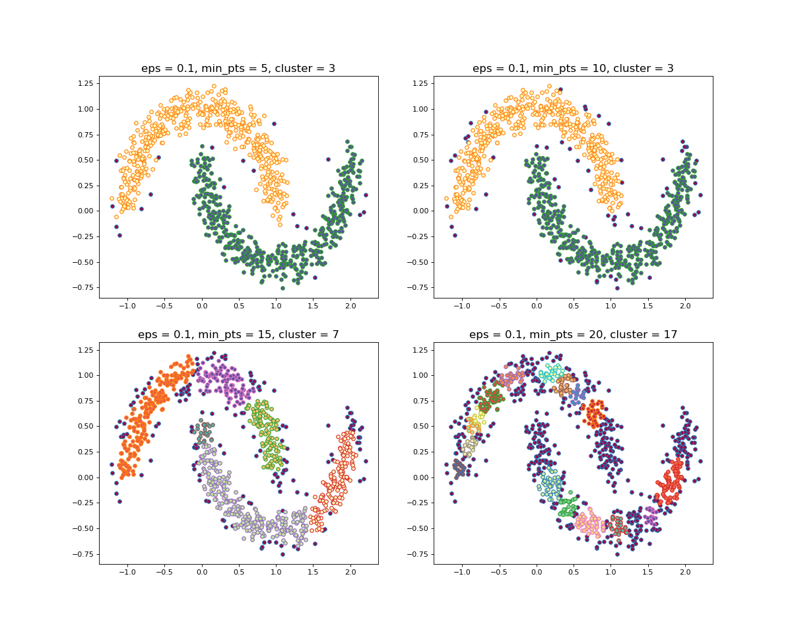
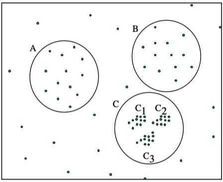
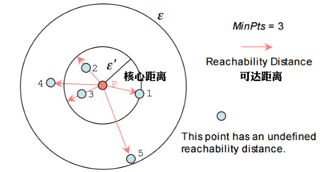
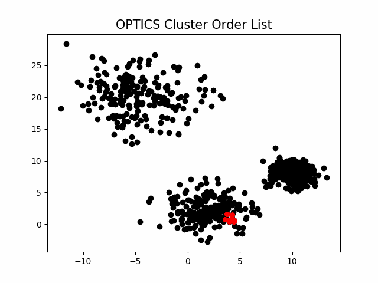
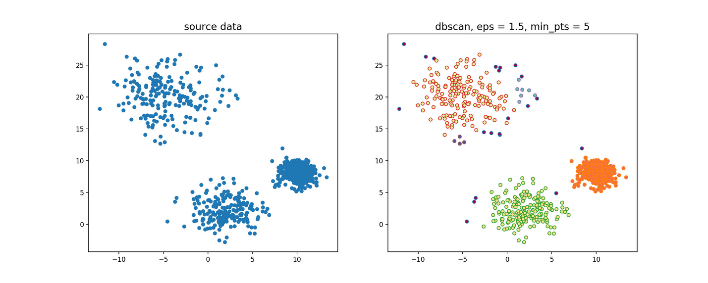
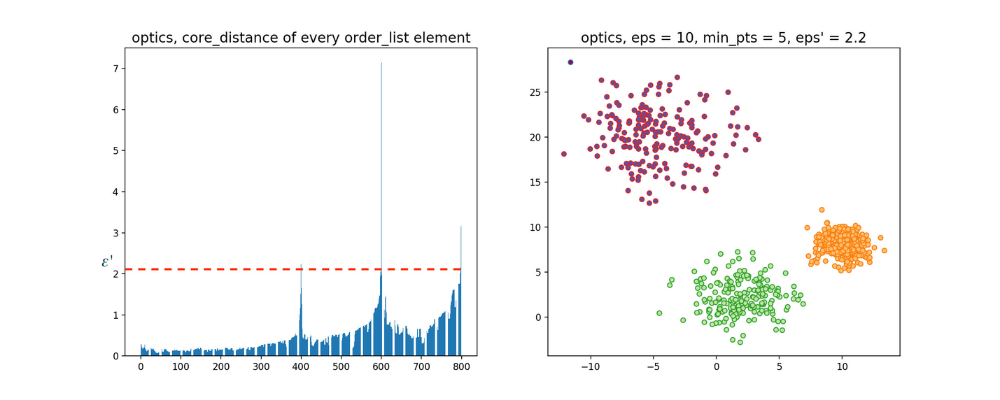

# 聚类算法

- [聚类算法](#聚类算法)
  - [K-means](#k-means)
    - [流程](#流程)
    - [特点](#特点)
  - [DBSCAN](#dbscan)
    - [名词定义](#名词定义)
      - [邻域 $(\\varepsilon-neighborhood）$](#邻域-varepsilon-neighborhood)
      - [密度 (density)](#密度-density)
      - [核心点 (core-point)](#核心点-core-point)
      - [边界点](#边界点)
      - [噪声点](#噪声点)
    - [流程](#流程-1)
    - [效果展示](#效果展示)
  - [OPTIC](#optic)
    - [定义](#定义)
    - [聚类过程](#聚类过程)
  - [参考资料](#参考资料)

## K-means

### 流程

- 创建K个点作为初始质心(通常是随机选择)

- 当任意一个点的簇分配结果发生改变时

- 对数据集中的每个数据点

  - 对每个质心，计算质心与数据点之间的距离

  - 将数据点分配到距其最近的簇

- 对每个簇，计算簇中所有点的均值并将均值作为质心

### 特点
- 需要提前确定K值
- 对初始质心点敏感（初始质心不同可能会导致聚类结果不同）
- 对异常数据敏感

## DBSCAN

基于密度的聚类方法了，该方法**需要定义两个参数$\varepsilon 和 M$，****分别表示密度的邻域半径和邻域密度阈值**。DBSCAN就是其中的典型。

### 名词定义
#### 邻域 $(\varepsilon-neighborhood）$

$$N_{\varepsilon }(x)=\left \{y\in  X|d(x, y) < \varepsilon \right \} $$

#### 密度 (density)

$$\rho (x)=\left | N_{\varepsilon }(x)\right |$$

#### 核心点 (core-point)

$$设x\in  X，若\rho (x) \geq M，则称x为X的核心点，记X中所有核心点构成的集合为X_c，记所有非核心点构成的集合为X_{nc}。$$

#### 边界点

$若x\in  X_{nc}，且\exists y\in  X，满足$
$$y\in  N_{\varepsilon }(x) \cap X_c$$
$即x的\varepsilon邻域中存在核心点，则称x为X的边界点，记X中所有的边界点构成的集合为X_{bd}$
$此外，边界点也可以这么定义：若x\in  X_{nc}，且x落在某个核心点的\varepsilon邻域内$
$则称x为X的一个边界点，一个边界点可能同时落入一个或多个核心点的\varepsilon邻域。$

#### 噪声点

如下图所示，设M=3，则A为核心点，B、C是边界点，而N是噪声点。

### 流程

### 效果展示

## OPTIC

### 定义

在DBSCAN算法中，使用了统一的ε值，当数据密度不均匀的时候，

如果设置了较小的ε值，则较稀疏的cluster中的节点密度会小于M，会被认为是边界点而不被用于进一步的扩展；

如果设置了较大的ε值，则密度较大且离的比较近的cluster容易被划分为同一个cluster，如下图所示。

> 如果设置的ε较大，将会获得A,B,C这3个cluster
> 
> 如果设置的ε较小，将会只获得C1、C2、C3这3个cluster

对于密度不均的数据选取一个合适的ε是很困难的，对于高维数据，由于维度灾难(Curse of imensionality), ε的选取将变得更加困难。

OPTICS(Ordering Points To Identify the Clustering Structure, OPTICS)实际上是DBSCAN算法的一种有效扩展，主要解决对输入参数敏感的问题。即选取有限个邻域参数εi​(0≤εi​≤ε) 进行聚类，这样就能得到不同邻域参数下的聚类结果。

举个例子，下图中假设M=3，半径是ε。那么P点的核心距离是d(1,P)，点2的可达距离是d(1,P)，点3的可达距离也是d(1,P)，点4的可达距离则是d(4,P)的距离。

### 聚类过程

该算法最终获取知识是一个输出序列，该序列按照密度不同将相近密度的点聚合在一起，而不是输出该点所属的具体类别，如果要获取该点所属的类型，需要再设置一个参数ε′(ε′≤ε)提取出具体的类别。这里我们举一个例子就知道是怎么回事了。

随机生成三组密度不均的数据，我们使用DBSCAN和OPTICS来看一下效果。

可见，OPTICS第一步生成的输出序列较好的保留了各个不同密度的簇的特征，根据输出序列的可达距离图，再设定一个合理的ε′，便可以获得较好的聚类效果

## 参考资料
- [聚类算法之K-means算法 with python code](https://zhuanlan.zhihu.com/p/77040610)
- [聚类算法之DBSCAN算法 with python code](https://zhuanlan.zhihu.com/p/77043965)
- [聚类算法之OPTICS算法 with python code](https://zhuanlan.zhihu.com/p/77052675)
